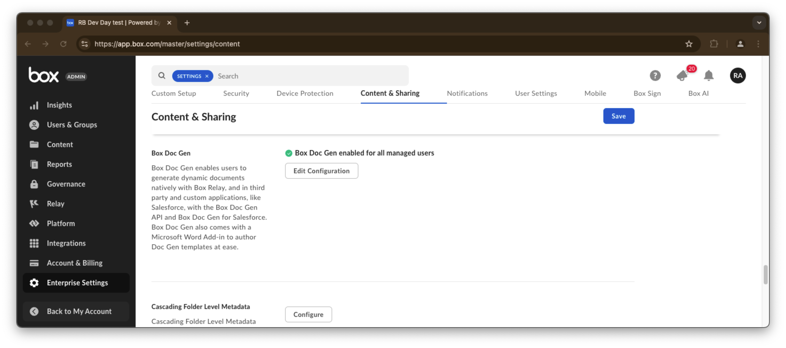
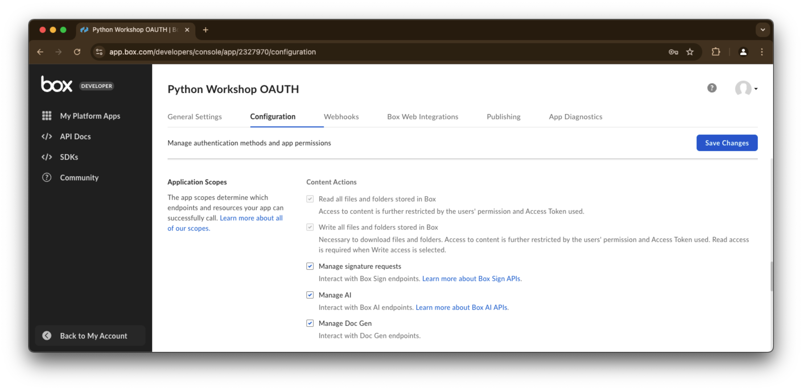
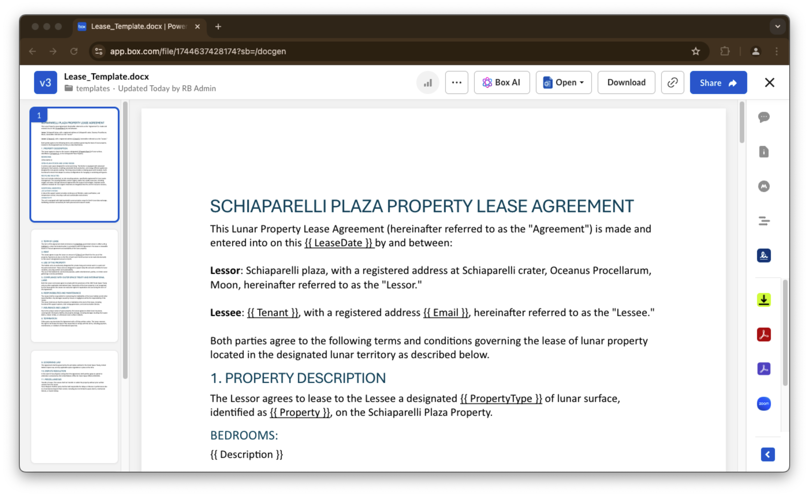

# Doc Gen

Welcome to the "Doc Gen Workshop," where you'll dive into the power of the Box Document Generation API. 

This workshop is designed to guide you through creating and managing dynamic, data-driven documents efficiently. 

Whether you’re automating lease agreements, generating invoices, or crafting other personalized documents, you’ll learn the foundational concepts, practical techniques, and advanced features of Doc Gen. 

By the end of this workshop, you’ll be equipped to leverage Box Doc Gen to streamline your workflows, improve accuracy, and reduce manual effort. 

Let's get started and explore how Doc Gen can transform your document processes!

## Pre-requisites
The Box document generation API is not available to all customers. Check if your current subscription includes this feature by navigating to this [administration page](https://app.box.com/master/settings/content) and make sure it is enabled for users. 



Also check if the Box Platform App you are using has the `Manage Doc Gen` scope enabled. If the scope is not available it means that either you subscription does not support this feature or this feature is not enabled.



## Concepts
Box Doc Gen operates similarly to a mail merge. A `template` document contains `tags` that serve as placeholders for fields to be filled with data from a dataset, resulting in a customized document for each record.

The document generation process is asynchronous. A `batch` associates a dataset with a `template`, initiating a `job` for each document to be generated.

### Creating a template
Creating a template with `tags` in a MS Word document can be as easy as manually typing the `tag` name in this format `{{ CustomerName }}`. 

Box does offer a [MS Word Add-In](https://support.box.com/hc/en-us/articles/36587535449747-Installing-Box-Doc-Gen-Add-in) to manage the `tags` on a template, and you can even paste `JSON` sample data to automatically create the tags. 

The `tags` include a tagging script that can help you when you have more sophisticated requirements. For example you can do things like:
- Complex objects in JSON: `{{ invoice.id }}`
- Formatting: `{{ invoice.date::format("mm-dd-yyyy") }}`
- Tables or master/detail structure
    - `{{ tablerow item in invoice.items }}`
    - `{{ item.id }} {{ item.name }} {{ item.quantity }} {{ item.price }}`
    - `{{ endtablerow }}`
- List tags
- Formatting lists
- Conditions
- Calculations

Take a look at this [document](https://support.box.com/hc/en-us/articles/36149723736723-Template-tags-reference) for a deep dive on the possibilities of tag scripting.

## Doc Gen documentation
* [Doc Gen Guide](https://developer.box.com/guides/docgen/)
* [Doc Gen Templates API](https://staging.developer.box.com/reference/get-docgen-template-jobs-id/)
* [Doc Gen API](https://staging.developer.box.com/reference/post-docgen-batches/)


# Exercises
## Setup
Create a `doc_gen_init.py` file on the root of the project and execute the following code:
```python
"""create sample content to box"""

import logging

from utils import ConfigOAuth, get_client_oauth
from workshops.doc_gen.create_samples import create_samples

logging.basicConfig(level=logging.INFO)
logging.getLogger("box_sdk_gen").setLevel(logging.CRITICAL)

conf = ConfigOAuth()


def main():
    client = get_client_oauth(conf)
    create_samples(client)


if __name__ == "__main__":
    main()

```
Result:
```yaml
INFO:root:Folder workshops with id: 260937698360
INFO:root:Folder doc_gen with id: 301695350038
INFO:root:Folder templates with id: 301695956946
INFO:root:Folder leases with id: 301836779172
INFO:root:      Uploaded Lease_Template.docx (1744637428174) 16813 bytes
INFO:root:      Uploaded Leases.csv (1744637248481) 25520 bytes
INFO:root:      Uploaded Leases.xlsx (1744628742518) 25072 bytes
INFO:root:      Uploaded sample.txt (1744638486280) 5178 bytes
```
Take note of the `Lease_Template.docx` file id, in my case `1744637428174`, and also the leases folder, in my case `301836779172`, you will need these next.

If you're curious, go ahead and open the template file on your browser, it should look like this:


Next, create a `doc_gen.py` file on the root of the project that you will use to write your code, and replace the LEASE_TEMPLATE_ID and LEASES_FOLDER_ID with your values from the execution of the init script.


```python
import logging
import random
from datetime import date, datetime
from time import sleep
from typing import List

from box_sdk_gen import (
    BoxClient,
    CreateDocgenBatchDestinationFolder,
    CreateDocgenBatchFile,
    CreateDocgenTemplateFile,
    DocgenBatchBase,
    DocgenDocumentGenerationData,
    DocgenTags,
    DocgenTemplate,
)
from dateutil.relativedelta import relativedelta

from utils.box_client_oauth import ConfigOAuth, get_client_oauth

logging.basicConfig(level=logging.INFO)
logging.getLogger("box_sdk_gen").setLevel(logging.CRITICAL)

LEASE_TEMPLATE_ID = "1744637428174"
LEASES_FOLDER_ID = "301836779172"


def main():
    """Simple script to demonstrate how to use the Box SDK"""
    conf = ConfigOAuth()
    client = get_client_oauth(conf)

    me = client.users.get_user_me()
    print(f"\nHello, I'm {me.name} ({me.login}) [{me.id}]")
    print("-" * 50)
    print()


if __name__ == "__main__":
    main()
```
Resulting in:
```yaml
Hello, I'm RB Admin (rbarbosa+devday@boxdemo.com) [31519033281]
--------------------------------------------------
```
## Setting a template
Since our template is already uploaded to Box, we just need to let Doc Gen know that we want to use that file as a template.

Let's create a method to do that:
```python
def set_file_as_template(client: BoxClient, file_id: str) -> DocgenTemplate:
    """Mark a file as a DocGen template"""
    # check if file exists and it is accessible
    file = client.files.get_file_by_id(file_id)

    template_base = client.doc_gen_template.create_docgen_template(file=CreateDocgenTemplateFile(id=file.id))
    return client.doc_gen_template.get_docgen_template_by_id(template_base.file.id)
```
and incorporate it in our main method:
```python
def main():
    ...
    # Set the MS Word file as a doc gen template
    template = set_file_as_template(client, LEASE_TEMPLATE_ID)
    print(f"Template created: {template.to_dict()}")
```

Resulting in:
```yaml
Template created: {'file': {'id': '1744637428174', 'type': 'file'}, 'file_name': 'Lease_Template.docx'}
```

## Listing the tags available to a template
We can query the documents set as templates and list the available tags:
```python
def main():
    ...
    # List template tags
    template_tags = client.doc_gen_template.get_docgen_template_tags(template_id=template.file.id)
    print("\nFound tags:")
    for tag in template_tags.entries:
        print(f"  - {tag.tag_content} : {tag.tag_type.name} : {tag.json_paths}")
```

Resulting in:
```yaml
Found tags:
  - {{ LeaseDate }} : TEXT : ['LeaseDate']
  - {{ Tenant }} : TEXT : ['Tenant']
  - {{ Email }} : TEXT : ['Email']
  - {{ PropertyType }} : TEXT : ['PropertyType']
  - {{ Property }} : TEXT : ['Property']
  - {{ Description }} : TEXT : ['Description']
  - {{ StartDate }} : TEXT : ['StartDate']
  - {{ EndDate }} : TEXT : ['EndDate']
  - {{ Rent }} : TEXT : ['Rent']
```

## Generating new lease agreements
We'll now create a method to make the dataset generation a bit easier, by adding this to your code:
```python
def generate_new_data(name: str, email: str, start_date: date) -> DocgenDocumentGenerationData:
    # gen random property id
    property = f"HAB-2-{random.randint(1000, 9999):04}"
    # todays date
    lease_date = date.today()
    # end date in 3 years
    end_date = start_date + relativedelta(years=3)

    return DocgenDocumentGenerationData(
        generated_file_name=f"{property}.pdf",
        user_input={
            "LeaseDate": lease_date.isoformat(),
            "Tenant": name,
            "Email": email,
            "PropertyType": "Dual Residential Pod",
            "Property": property,
            "Description": "Two private and spacious bedrooms, each equipped with a temperature-regulating system, offering breathtaking views of the lunar landscape through reinforced transparent panels. Bedrooms are fitted with built-in storage for personal items and lunar suits.",
            "StartDate": start_date.isoformat(),
            "EndDate": end_date.isoformat(),
            "Rent": f"${5535:,.2f}",
        },
    )
```
Next the method to actually call the Doc Gen API:
```python
def generate_new_document(
    client: BoxClient, template_id: str, destination_folder_id: str, data: List[DocgenDocumentGenerationData]
) -> DocgenBatchBase:
    """Generate a new document from a template"""
    template_file = CreateDocgenBatchFile(id=template_id)
    destination_folder = CreateDocgenBatchDestinationFolder(id=destination_folder_id)
    return client.doc_gen.create_docgen_batch(
        file=template_file,
        input_source="api",
        destination_folder=destination_folder,
        output_type="pdf",
        document_generation_data=data,
    )
```
Finally we orchestrate this in our main method. Once we call the Doc Gen API, it creates a `batch` containing a `job` for each file to be generated. We'll also list all `jobs` for our `batch`.
```python
def main():
    ...
    # Generate 5 new lease agreement
    docs_data: List[DocgenDocumentGenerationData] = []
    start_date = date.today().replace(day=1) + relativedelta(months=1)

    # Create 5 random person names
    persons = ["John Doe", "Jane Doe", "Alice Smith", "Bob Johnson", "Eve Brown"]

    for person in persons:
        lease_data = generate_new_data(
            name=person,
            email=f"{person.replace(' ', '.').lower()}@example.com",
            start_date=start_date,
        )
        docs_data.append(lease_data)

    batch = generate_new_document(client, template.file.id, LEASES_FOLDER_ID, docs_data)
    print(f"\nNew batch created: {batch.to_dict()}")

    # Get jobs in batch
    print("\nJobs in batch:")
    jobs = client.doc_gen.get_docgen_batch_job_by_id(batch.id)
    for job in jobs.entries:
        print(f"  - Job {job.id} - {job.status.name}")
```
Resulting in:
```yaml
New batch created: {'id': '64528422-fbf4-4f8d-b6a0-b099c6572cf2', 'type': 'docgen_batch'}

Jobs in batch:
  - Job 22234947 - PENDING
  - Job 22237347 - PENDING
  - Job 22239747 - PENDING
  - Job 22242147 - PENDING
  - Job 22245001 - PENDING
```
## Job details
As you would expect this operation is asynchronous. We can poll the `jobs` details to check on their progress:
```python
def main():
    ...
    # Lis jobs in batch
    print("\nJob details:")
    for job in jobs.entries:
        job_details = client.doc_gen.get_docgen_job_by_id(job.id)
        print(f"  - {job_details.to_dict()}\n")
        sleep(3)
```

Resulting in:
```yaml
Job details:
  - {'id': '22234947', 'type': 'docgen_job', 'batch': {'id': '64528422-fbf4-4f8d-b6a0-b099c6572cf2', 'type': 'docgen_batch'}, 'template_file': {'id': '1744637428174', 'type': 'file'}, 'template_file_version': {'id': '1921633021971', 'type': 'file_version'}, 'status': 'pending', 'output_type': 'pdf'}

  - {'id': '22237347', 'type': 'docgen_job', 'batch': {'id': '64528422-fbf4-4f8d-b6a0-b099c6572cf2', 'type': 'docgen_batch'}, 'template_file': {'id': '1744637428174', 'type': 'file'}, 'template_file_version': {'id': '1921633021971', 'type': 'file_version'}, 'status': 'submitted', 'output_type': 'pdf'}

  - {'id': '22239747', 'type': 'docgen_job', 'batch': {'id': '64528422-fbf4-4f8d-b6a0-b099c6572cf2', 'type': 'docgen_batch'}, 'template_file': {'id': '1744637428174', 'type': 'file'}, 'template_file_version': {'id': '1921633021971', 'type': 'file_version'}, 'status': 'submitted', 'output_type': 'pdf'}

  - {'id': '22242147', 'type': 'docgen_job', 'batch': {'id': '64528422-fbf4-4f8d-b6a0-b099c6572cf2', 'type': 'docgen_batch'}, 'template_file': {'id': '1744637428174', 'type': 'file'}, 'template_file_version': {'id': '1921633021971', 'type': 'file_version'}, 'status': 'submitted', 'output_type': 'pdf'}

  - {'id': '22245001', 'type': 'docgen_job', 'batch': {'id': '64528422-fbf4-4f8d-b6a0-b099c6572cf2', 'type': 'docgen_batch'}, 'template_file': {'id': '1744637428174', 'type': 'file'}, 'template_file_version': {'id': '1921633021971', 'type': 'file_version'}, 'status': 'completed', 'output_type': 'pdf', 'output_file': {'type': 'file', 'id': '1744864876727'}, 'output_file_version': {'type': 'file_version', 'id': '1921647669527'}}
```
> Notice the different states in the example above.
## Listing jobs
You can list `jobs` by user:
```python
def main():
    ...
    # List all jobs for user
    user_jobs = client.doc_gen.get_docgen_jobs(limit=50)
    print("\nAll jobs for current user:")
    for job in user_jobs.entries:
        print(f"  - Job {job.id} {datetime.fromtimestamp(int(job.created_at)).isoformat()} {job.status.name}")
```
Resulting in:
```yaml
All jobs for current user:
  - Job 21954948 2025-01-08T13:06:25 COMPLETED
  - Job 21980992 2025-01-08T13:16:14 COMPLETED
  - Job 21983392 2025-01-08T13:16:14 COMPLETED
  - Job 21985792 2025-01-08T13:16:14 COMPLETED
  - Job 21988192 2025-01-08T13:16:14 COMPLETED
```
Or by template:
```python
def main():
    ...
    # List all jobs by template
    template_jobs = client.doc_gen_template.get_docgen_template_job_by_id(template.file.id)
    print("\nAll jobs for template:")
    for job in template_jobs.entries:
        print(f"  - Job {job.id} {datetime.fromtimestamp(int(job.created_at)).isoformat()} {job.status.name}")
```
Resulting in:
```yaml
All jobs for template:
  - Job 21954948 2025-01-08T13:06:25 COMPLETED
  - Job 21980992 2025-01-08T13:16:14 COMPLETED
  - Job 21983392 2025-01-08T13:16:14 COMPLETED
  - Job 21985792 2025-01-08T13:16:14 COMPLETED
  - Job 21988192 2025-01-08T13:16:14 COMPLETED
```

## Removing a template
To wrap up, we can remove the Doc Gen template flag from the template document:
```python
def main():
    ...
    # Remove the template
    client.doc_gen_template.delete_docgen_template_by_id(template.file.id)

    # List all templates
    templates = client.doc_gen_template.get_docgen_templates()
    print("\nAll templates:")

    if templates.entries:
        for template in templates.entries:
            print(f"  - {template.to_dict()}")
    else:
        print("  - No templates found")
```
Resulting in:
```yaml
All templates:
  - No templates found
```

## Extra credit
There are plenty of use cases where Doc Gen can be applied, and in this particular example one stands out.
* Send the generated leases for signature.


## Final thoughts
Congratulations on completing the Doc Gen Workshop! You've gained hands-on experience with creating templates, utilizing tags, and generating dynamic documents.

This powerful API can be used for automating document workflows for your business needs. Remember, the possibilities with Doc Gen extend far beyond the exercises here. Keep experimenting, integrating, and building solutions for your processes. 

We can't wait to see what you'll create!


