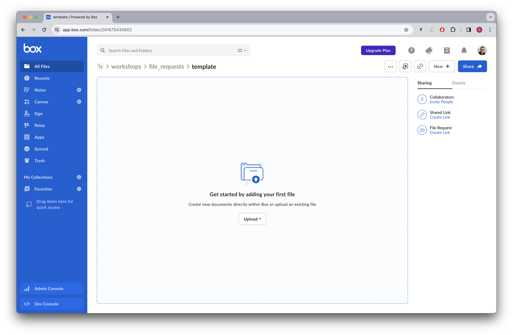
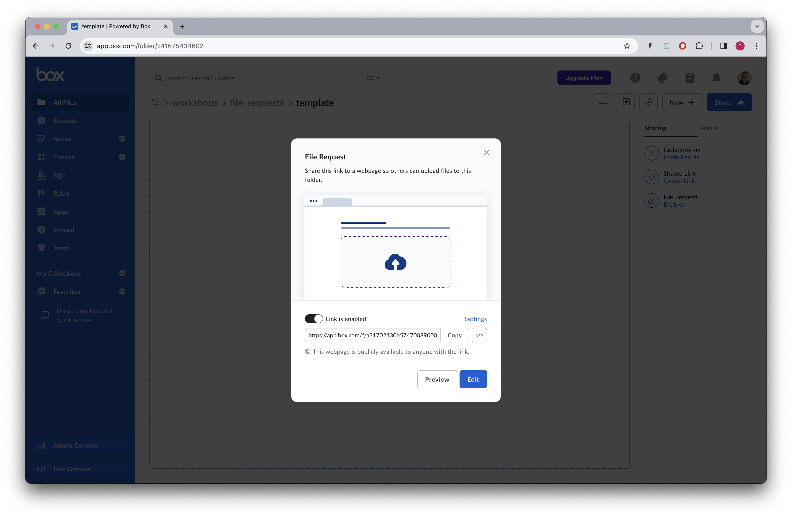
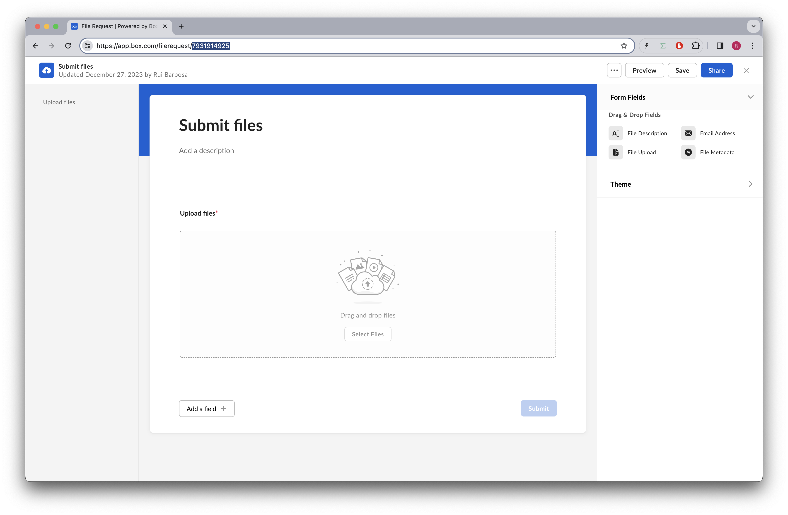
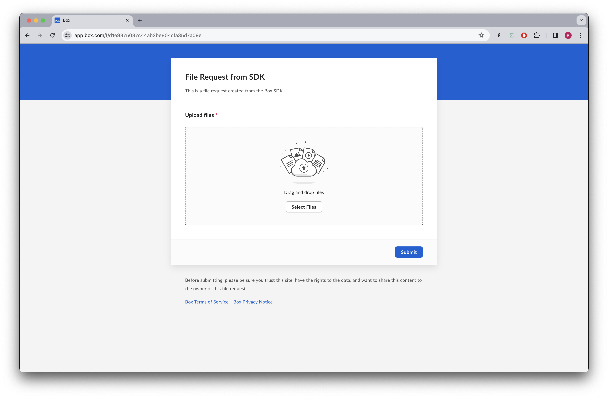
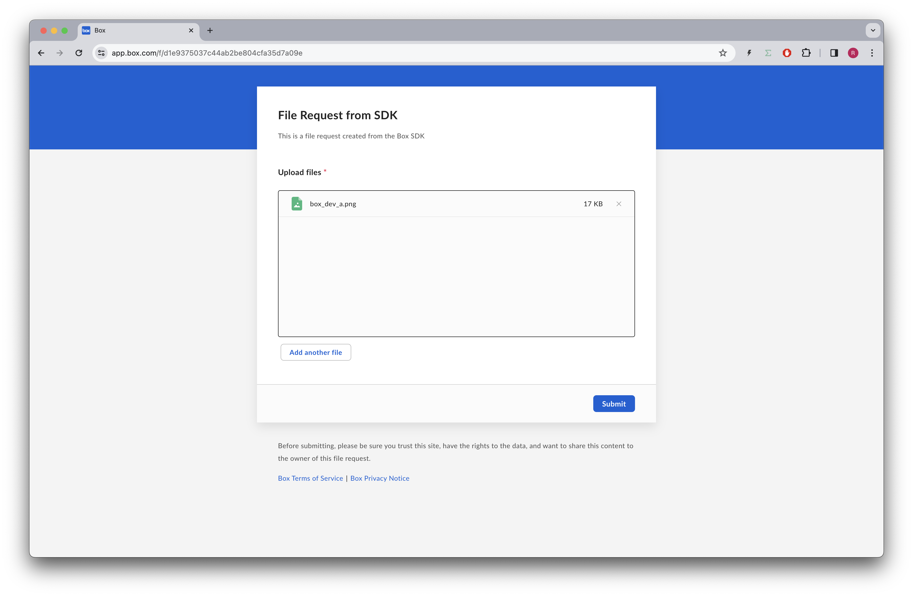
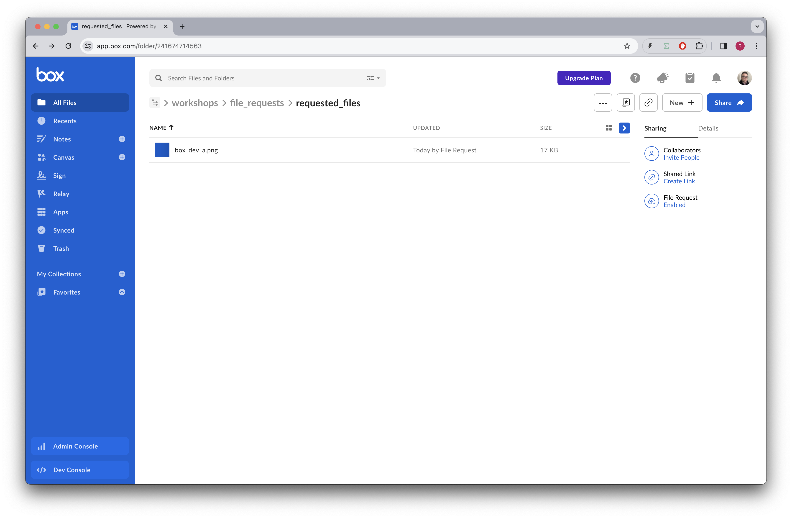

# File requests

Box file requests provide a nice interface to collect files from anyone, and place them in a Box folder of your choice.

Once created you can send the URL to the users via any form of notification, or you can embed the file request in your application.

On top of collecting files, the file request can collect more data, including email, description, and metadata.

## Pre-requisites
The free Box accounts do not support files requests, so you will need to have a Box Business Plan, or a full developer account to be able to use this feature.

## Concepts

Within the Box Platform API we can't create a file request directly. We can however copy and customize an existing file request.

## File requests API
References to our documentation:
* [Support note](https://support.box.com/hc/en-us/articles/360045304613-Introducing-Box-File-Request)
* [Guide](https://developer.box.com/guides/file-requests/)
* [API Reference](https://developer.box.com/reference/resources/file-request/)

# Exercises
## Setup
Create a `file_requests_init.py` file on the root of the project and execute the following code:
```python
"""create sample content to box"""
import logging
from utils.box_client_oauth import ConfigOAuth, get_client_oauth

from workshops.file_requests.create_samples import create_samples

logging.basicConfig(level=logging.INFO)
logging.getLogger("box_sdk_gen").setLevel(logging.CRITICAL)

conf = ConfigOAuth()


def main():
    client = get_client_oauth(conf)
    create_samples(client)


if __name__ == "__main__":
    main()
```
Result:
```
INFO:root:Folder workshops with id: 234108232105
INFO:root:Folder file_requests with id: 241675595670
INFO:root:Folder template with id: 241675434602
INFO:root:Folder requested_files with id: 241674714563
```

Next, create a `file_requests.py` file on the root of the project that you will use to write your code.


```python
"""Box Shared links"""
import logging

from utils.box_client_oauth import ConfigOAuth, get_client_oauth


# from utils.oauth_callback import open_browser

logging.basicConfig(level=logging.INFO)
logging.getLogger("box_sdk_gen").setLevel(logging.CRITICAL)

TEMPLATE_FOLDER = "241675434602"
REQUESTS_FOLDER = "241674714563"


def main():
    """Simple script to demonstrate how to use the Box SDK"""
    conf = ConfigOAuth()
    client = get_client_oauth(conf)

    user = client.users.get_user_me()
    print(f"\nHello, I'm {user.name} ({user.login}) [{user.id}]")


if __name__ == "__main__":
    main()
```
Resulting in:
```
Hello, I'm Rui Barbosa  [18622116055]
```

## Create a file request template

To create a file request we need to use the Box web application.
Navigate to workshops > file_requests > template and create a file request.



Select the file request create link and you should see something like:


Notice that a file request link has been create.

Pressing the `edit` button will allow you to customize the file request. We won't be customizing the request just yet, but please note the file request URL as it contain the id.



In my case the file request id is `7931914925`.

## File request details

Let's start by getting the file request details and print them.

```python
FILE_REQUEST_TEMPLATE = "7931914925"
REQUESTS_FOLDER = "241674714563"


def get_file_request(client: Client, file_request_id: str) -> FileRequest:
    return client.file_requests.get_file_request_by_id(file_request_id)


def print_file_request(file_request: FileRequest):
    print(f"\nFile Request: {file_request.id} - {file_request.title}")
    print(f"  Description: {file_request.description}")
    print(f"  Folder: {file_request.folder.id} - {file_request.folder.name}")
    print(f"  Status: {file_request.status.value}")
    print(f"  URL: {file_request.url}")
```

And using it on the main script:
```python
def main():
    ...

    file_request_template = get_file_request(client, FILE_REQUEST_TEMPLATE)
    print_file_request(file_request_template)
```
Resulting in:
```yaml
File Request: 7931914925 - Submit files
  Description: 
  Folder: 241675434602 - template
  Status: active
  URL: /f/a31702430b5747008900023cec7e2d7b
```

## Create a file request
We can now use this file request to create a new file request. Consider the following code:

```python
def create_file_request(
    client: Client,
    from_file_request_id: str,
    folder_id: str,
    title: str | None = None,
    description: str | None = None,
    is_email_required: bool | None = None,
    is_description_required: bool | None = None,
    expires_at: str | None = None,
) -> FileRequest:
    folder = CreateFileRequestCopyFolderArg(
        folder_id, CreateFileRequestCopyFolderArgTypeField.FOLDER
    )
    status = CreateFileRequestCopyStatusArg.ACTIVE

    file_request = client.file_requests.create_file_request_copy(
        from_file_request_id,
        folder,
        title,
        description,
        status,
        is_email_required,
        is_description_required,
        expires_at,
    )
    return file_request
```

And using it on the main script:
```python
def main():
    ...

    # create a file request
    file_request = create_file_request(
        client,
        FILE_REQUEST_TEMPLATE,
        REQUESTS_FOLDER,
        title="File Request from SDK",
        description="This is a file request created from the Box SDK",
    )
    print_file_request(file_request)
```
Resulting in:
```yaml
File Request: 7932434325 - File Request from SDK
  Description: This is a file request created from the Box SDK
  Folder: 241674714563 - requested_files
  Status: active
  URL: /f/d1e9375037c44ab2be804cfa35d7a09e
```
If we now open the Box web application using the URL we should see the new file request:



Go ahead and upload a file to the file request:



Once the upload is complete you'll see the file in the specified upload folder, not the template:




## Extra Credit

# Final thoughts


