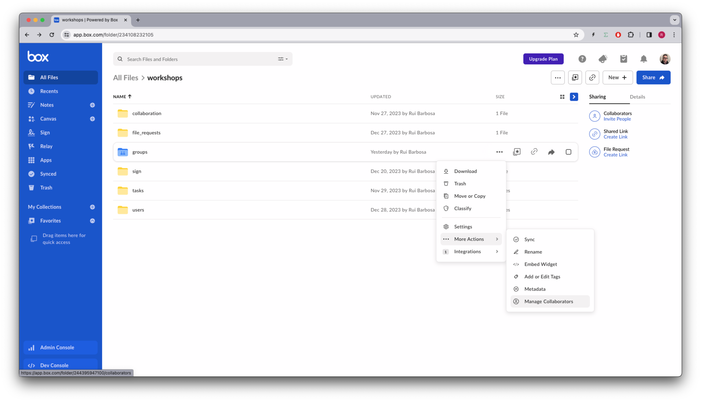
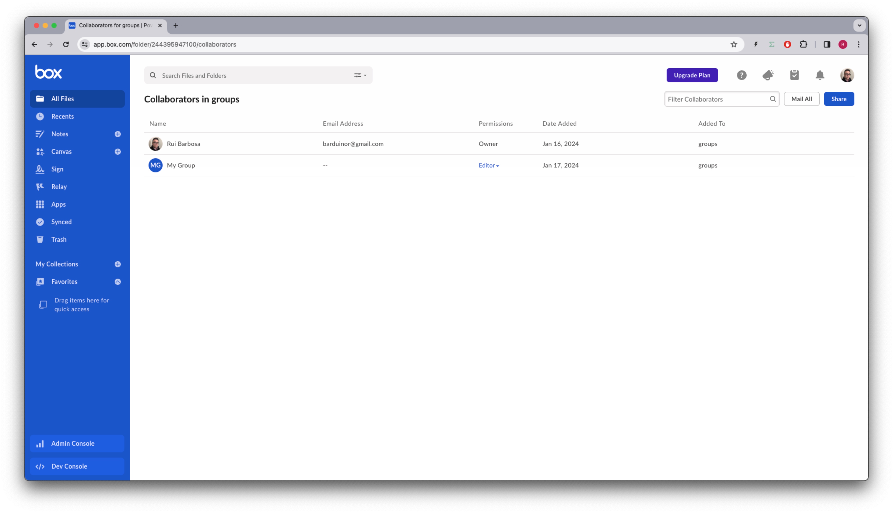

# Groups

With Groups, you have the ability to add multiple users to folders and assign access permissions quickly and easily. When implemented effectively, groups streamline deployment and make long-term user management much simpler.

## Pre-requisites
The free Box accounts do not support multiple users, so you will need to have a Box paid account, or a full developer account to be able to use this feature.

## Concepts

Dealing with groups can be divided in two parts, and it is reflected in the SDK by importing two different modules:
### Groups manager
The groups managers implements CRUD operations with groups

Besides `name` and `description`, groups have more attributes that can be used to control access to content:

* `provenance` - an optional string, was designed to keep track of which external source this group is coming, for example Active Directory, or Okta. Setting this will also prevent Box admins from editing the group name and its members directly via the Box web application. This is desirable for one-way syncing of groups.

* `external_sync_identifier`, an optional string, represents arbitrary identifier that can be used by external group sync tools to link this Box Group to an external group. Example values of this field could be an Active Directory Object ID or a Google Group ID. We recommend you use of this field in order to avoid issues when group names are updated in either Box or external systems.

* `invitability_level`, an optional `enum`, specifies who can invite the group to collaborate on folders. Administrators only, administrator and members of the groups or all managed users in the enterprise.

* `member_viewability_level`, and optional `enum`, specifies who can see the members of the group. Administrators only, administrator and members of the groups or all managed users in the enterprise.

### Group memberships manager
A group membership represents the users associated to a group, and the membership manager implements CRUD operations to group memberships.

A user exists in a group with a role, which can be either a `member` or an `admin`, where admins can add and remove members from the group.


## Groups and membership documentation
References to our documentation:
* [SDK groups manager](https://github.com/box/box-python-sdk-gen/blob/main/docs/groups.md)
* [SDK memberships manager](https://github.com/box/box-python-sdk-gen/blob/main/docs/memberships.md)
* [Guide](https://developer.box.com/guides/collaborations/groups/)
* [Group API](https://developer.box.com/reference/resources/group/)
* [Group membership API](https://developer.box.com/reference/resources/group-membership/)
* [Admin operations](https://support.box.com/hc/en-us/articles/360043694554-Creating-and-Managing-Groups)

# Exercises
## Setup
Create a `groups_init.py` file on the root of the project and execute the following code:
```python
"""create sample content to box"""
import logging
from utils.box_client_oauth import ConfigOAuth, get_client_oauth

from workshops.groups.create_samples import create_samples

logging.basicConfig(level=logging.INFO)
logging.getLogger("box_sdk_gen").setLevel(logging.CRITICAL)

conf = ConfigOAuth()


def main():
    client = get_client_oauth(conf)
    create_samples(client)


if __name__ == "__main__":
    main()

```
Result:
```yaml
INFO:root:Folder workshops with id: 234108232105
INFO:root:Folder groups with id: 244395947100
INFO:root:      Uploaded sample_file.txt (1416059157146) 11 bytes
```

Next, create a `groups.py` file on the root of the project that you will use to write your code.
Create a DEMO_FOLDER constant with the id of the `groups` folder you got from the previous step.

```python
import logging

from box_sdk_gen.client import BoxClient as Client
from box_sdk_gen import BoxAPIError
from box_sdk_gen.schemas import (
    User,
    Group,
    GroupMembership,
    Collaboration,
)
from box_sdk_gen.managers.groups import (
    CreateGroupInvitabilityLevel,
    CreateGroupMemberViewabilityLevel,
)
from box_sdk_gen.managers.memberships import (
    CreateGroupMembershipUser,
    CreateGroupMembershipGroup,
    CreateGroupMembershipRole,
)

from box_sdk_gen.managers.user_collaborations import (
    CreateCollaborationItemTypeField,
    CreateCollaborationItem,
    CreateCollaborationAccessibleBy,
    CreateCollaborationRole,
    CreateCollaborationAccessibleByTypeField,
)


from utils.box_client_oauth import ConfigOAuth, get_client_oauth


logging.basicConfig(level=logging.INFO)
logging.getLogger("box_sdk_gen").setLevel(logging.CRITICAL)

DEMO_FOLDER = "244395947100"


def main():
    conf = ConfigOAuth()
    client = get_client_oauth(conf)

    user = client.users.get_user_me()
    print(f"\nHello, I'm {user.name} ({user.login}) [{user.id}]")   


if __name__ == "__main__":
    main()
```

Resulting in:

```
Hello, I'm Rui Barbosa (barduinor@gmail.com) [18622116055]
```
## Creating a group
Let's start by creating a group.
Consider this method:
```python
def create_group(
    client: Client,
    name: str,
    provenance: str = "box_sdk_gen",
    external_sync_identifier: str = None,
    description: str = None,
) -> Group:
    """Create group"""

    invitability_level = CreateGroupInvitabilityLevel.ADMINS_AND_MEMBERS
    member_viewability_level = CreateGroupMemberViewabilityLevel.ADMINS_AND_MEMBERS

    try:
        group = client.groups.create_group(
            name,
            provenance=provenance,
            external_sync_identifier=external_sync_identifier,
            description=description,
            invitability_level=invitability_level,
            member_viewability_level=member_viewability_level,
        )
    except BoxAPIError as err:
        if (
            err.response_info.status_code == 409
            and err.response_info.body.get("code", None) == "conflict"
        ):
            # group already exists
            groups = client.groups.get_groups(filter_term=name)
            for group in groups.entries:
                if group.name == name:
                    return group
    return group
```

Using this method, we can create a group with the following code:
```python
def main():
    ...

    # create group
    my_group = create_group(client, "My Group")
    print(f"Created group {my_group.name} ({my_group.id})")
``` 

Resulting in:
```yaml
Hello, I'm Rui Barbosa (barduinor@gmail.com) [18622116055]
Created group My Group (18394127658)
```

## Listing groups
Now that we have a group, we are going to need a method to list all groups.
Consider this method:
```python
def list_groups(client: Client) -> None:
    """List groups"""
    print("\nGroups:")
    for group in client.groups.get_groups().entries:
        print(f" - {group.name} ({group.id})")

def main():
    ...

    # list groups
    list_groups(client)
```

Results in:
```yaml
Groups:
 - My Group (18394127658)
```
## Adding a user to a group
A group wouldn't be very useful if we couldn't add users to it. Let's create a method to add a user to a group:
```python
def add_user_to_group(
    client: Client,
    user: CreateGroupMembershipUser,
    group: CreateGroupMembershipGroup,
    role: CreateGroupMembershipRole,
) -> GroupMembership:
    """Add user to group"""

    try:
        group_membership = client.memberships.create_group_membership(user, group, role=role)
        
    except BoxAPIError as err:
        if (
            err.response_info.status_code == 409
            and err.response_info.body.get("code", None) == "conflict"
        ):
            # user already in group
            group_memberships = client.memberships.get_group_memberships(
                group.id
            )
            for group_membership in group_memberships.entries:
                if group_membership.user.id == user.id:
                    return group_membership

    return group_membership
```

Using this method, we can add a user to a group with the following code:
```python
def main():
    ...

    # add me to group as administrator
    group_membership = add_user_to_group(
        client,
        CreateGroupMembershipUser(me.id),
        CreateGroupMembershipGroup(my_group.id),
        CreateGroupMembershipRole.ADMIN,
    )
    print(
        f"\nAdded {group_membership.user.name} ",
        f"({group_membership.user.login}) ",
        f"to {group_membership.group.name} ({group_membership.group.id}) "
        f"as {group_membership.role.value}",
    )
```

Resulting in:
```yaml
Added Rui Barbosa (barduinor@gmail.com) to My Group (18394127658) as admin
```

## Listing group members
Now let's create a method to list all members of a group:
```python
def list_group_members(client: Client, group: Group) -> None:
    """List group members"""
    print(f"\nGroup members for {group.name} ({group.id}):")
    for group_membership in client.memberships.get_group_memberships(
        group.id
    ).entries:
        print(
            f" - {group_membership.user.name} as ",
            f"{group_membership.role.value} ",
            f"[{group_membership.user.id}] ",
        )
```

Using it in the main method:
```python
def main():
    ...

    # list group members
    list_group_members(client, my_group)
```

Results in:
```yaml
Group members for My Group (18394127658):
 - Rui Barbosa as admin [18622116055] 
```

## Listing user groups
We can also list all groups a user is a member of:
```python
def list_user_groups(client: Client, user: User) -> None:
    """List groups for user"""
    print(f"\nGroups for {user.name} ({user.id}):")
    for group_membership in client.memberships.get_user_memberships(
        user.id
    ).entries:
        print(
            f" - {group_membership.group.name} as ",
            f"{group_membership.role.value} ",
            f"[{group_membership.group.id}] ",
        )
```

Using it in the main method:
```python
def main():
    ...

    # list groups for me
    list_user_groups(client, me)
```

Results in:
```yaml
Groups for Rui Barbosa (18622116055):
 - My Group as admin [18394127658] 
```

## Sharing a folder with a group
Now that we understand the mechanics of groups and memberships, let's put it to use by sharing a folder with a group.
Consider this method:
```python
def share_folder_with_group(
    client: Client, folder_id: str, group: Group
) -> Collaboration:
    """Share folder with group"""

    try:
        collaboration = client.user_collaborations.create_collaboration(
            item=CreateCollaborationItem(
                type=CreateCollaborationItemTypeField.FOLDER, id=DEMO_FOLDER
            ),
            accessible_by=CreateCollaborationAccessibleBy(
                CreateCollaborationAccessibleByTypeField.GROUP, group.id
            ),
            role=CreateCollaborationRole.EDITOR,
        )
    except BoxAPIError as err:
        if (
            err.response_info.status_code == 409
            and err.response_info.body.get("code", None) == "conflict"
        ):
            # folder already shared with group
            collaborations = (
                client.list_collaborations.get_folder_collaborations(folder_id)
            )
            for collaboration in collaborations.entries:
                if collaboration.accessible_by.id == group.id:
                    return collaboration

    return collaboration
```
Using this method, we can share a folder with a group with the following code:
```python
def main():
    ...

    # share DEMO_FOLDER with group
    collaboration = share_folder_with_group(client, DEMO_FOLDER, my_group)
    print(
        f"\nShared folder <{collaboration.item.name}> ",
        f"({collaboration.item.id}) ",
        f"with group <{collaboration.accessible_by.name}> ",
        f"({collaboration.accessible_by.id}) "
        f"as {collaboration.role.value}",
    )
```

Resulting in:
```yaml
Shared folder <groups> (244395947100) with group <My Group> (18394127658) as editor
```

Navigating in the box.com app to the workshops folder, we can see that the groups folder is now shared since it shows up in blue. 



We can inspect the collaboration to see that it is shared with `My Group` that we created, by clicking on the `manage collaborators` in the sub menu:



## Deleting a group
Finally, let's create a method to delete a group:
```python
def delete_group(client: Client, group: Group) -> None:
    """Delete group"""
    client.groups.delete_group_by_id(group.id)
```

Using it in the main method:
```python
def main():
    ...

    # delete group
    delete_group(client, my_group)
    print(f"\nDeleted group {my_group.name} ({my_group.id})")
```

Results in:
```yaml
Deleted group My Group (18394127658)
```

## Extra credit
There are more operations available in the SDK, try implementing these:
* Update a group name and description
* Update a group membership role
* Remove a user from a group


