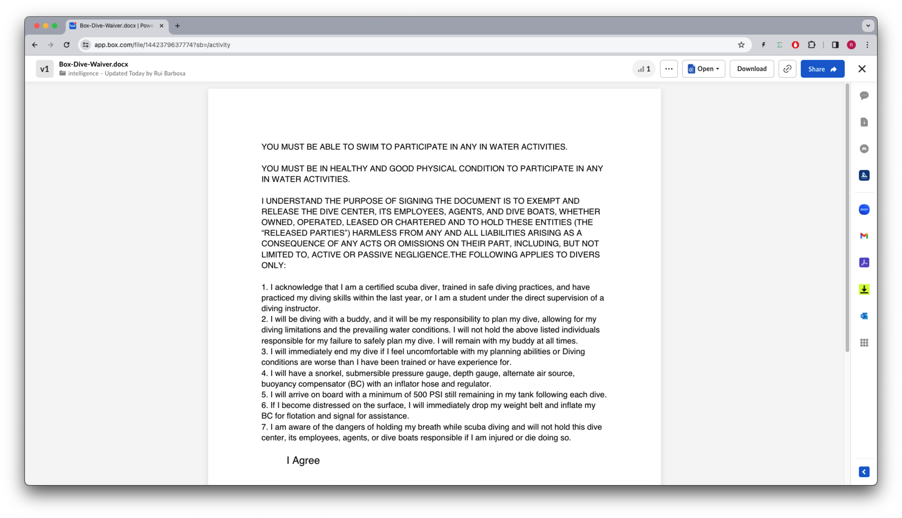

# Box AI (Intelligence)
In today's data-rich landscape, extracting meaningful insights from unstructured documents is crucial. The Box AI API provides a powerful toolkit for developers to tap into the content of documents, enabling summarization, and conversational AI. 

In this workshop, we'll dive deep into the capabilities of Box AI API, exploring how it empowers applications to swiftly analyze and comprehend textual content.


## Pre-requisites
The Box AI API hasn't been released yet, and it is currently undergoing a closed beta.
To complete this workshop you will need to have a Box application specifically enabled for the Box AI API.

## Concepts
The Box AI api has 3 main concepts:

* **Ask** - Enables your app to ask questions around some context.
* **Text Generation** - Enables your app to have a conversation with the AI, building on the previous questions and answers.
* **Context** - The context is the information that the Box AI will use to answer the questions. It can be a document, multiple documents or a snippet of text.

## Box AI documentation
This API doesn't have a public documentation yet, stay tunned for updates.

# Exercises
## Setup
Create a `intelligence_init.py` file on the root of the project and execute the following code:
```python
"""create sample content to box"""

import logging
from utils.box_client_oauth import ConfigOAuth, get_client_oauth

from workshops.intelligence.create_samples import create_samples

logging.basicConfig(level=logging.INFO)
logging.getLogger("box_sdk_gen").setLevel(logging.CRITICAL)

conf = ConfigOAuth()


def main():
    client = get_client_oauth(conf)
    create_samples(client)


if __name__ == "__main__":
    main()

```
Result:
```yaml
INFO:root:Folder workshops with id: 234108232105
INFO:root:Folder intelligence with id: 248676986369
INFO:root:      Uploaded Box-Dive-Waiver.docx (1442379637774) 7409 bytes
```
A sample document was uploaded to the Box folder `All files -> Workshops -> intelligence`. Open your Box app and check the content of the file.



## Ask

Create a `intelligence_ask.py` file on the root of the project that you will use to write your code.

For the DEMO_FILE constant, use the file id from the previous step, in my case it is `1442379637774`.


```python
"""Box Shared links"""

import logging

from box_sdk_gen.client import BoxClient as Client

from box_sdk_gen import BoxAPIError
from box_sdk_gen.client import BoxClient as Client
from box_sdk_gen.managers.ai import CreateAiAskMode, CreateAiAskItems, AiResponse

from utils.box_client_oauth import ConfigOAuth, get_client_oauth


logging.basicConfig(level=logging.INFO)
logging.getLogger("box_sdk_gen").setLevel(logging.CRITICAL)

DEMO_FILE = "1442379637774"


def main():
    """Simple script to demonstrate how to use the Box SDK"""
    conf = ConfigOAuth()
    client = get_client_oauth(conf)

    me = client.users.get_user_me()
    print(f"\nHello, I'm {me.name} ({me.login}) [{me.id}]")


if __name__ == "__main__":
    main()
```

Resulting in:

```yaml
Hello, I'm Rui Barbosa (barduinor@gmail.com) [18622116055]
```

Now, let's create a method to ask a question to the AI.

```python
def ask(client: Client, question: str, file_id: str, content: str = None) -> AiResponse:
    """Ask a question to the AI"""

    if file_id is None:
        raise ValueError("file_id must be provided")

    mode = CreateAiAskMode.SINGLE_ITEM_QA

    items = [CreateAiAskItems(id=file_id, type="file")]

    # add content if provided
    if content is not None:
        items[0]["content"] = content

    try:
        ai_response = client.ai.create_ai_ask(mode=mode, prompt=question, items=items)

    except BoxAPIError as e:
        print(f"Error: {e}")

    return ai_response
```

Next, let's create a input prompt cycle in our main method, so the user can interact with the AI.

```python
def main():
    ...

    # Summarize the file
    response = ask(
        client,
        "Summarize document.",
        DEMO_FILE,
    )
    print(f"\nResponse: {response.answer}")

    while True:
        question = input("\nAsk a question (type 'exit' to quit): ")
        if question == "exit":
            break
        response = ask(
            client,
            question,
            DEMO_FILE,
        )
        print(f"\nResponse: {response.answer}")
```

This will result in:

```yaml
Response: The document outlines the requirements and responsibilities for participants in water activities, particularly scuba diving. It emphasizes the need for swimmers to be in good physical condition and understand the risks involved. For certified divers, it specifies safety measures such as diving with a buddy, carrying necessary equipment, monitoring air supply, and responding appropriately to distress situations. The document also includes an agreement section where individuals can acknowledge their understanding of these conditions by signing their full name.

If you have any specific questions or need further details from the document provided above please let me know!

Ask a question (type 'exit' to quit): 
```

You can now continue to asks questions to the AI, and it will answer based on the context of the document.

For example:

```yaml
Ask a question (type 'exit' to quit): do I need to know how to swim?

Response: Yes, you must be able to swim to participate in any in water activities.

Ask a question (type 'exit' to quit): 
```
Feel free to ask more questions for fun. You can refer to the document for inspiration. Once you're done type exit to terminate the program.

## Text Generation

The text generation mode allows you to have a conversation with the AI, building on the previous questions and answers.

Create a `intelligence_text_gen.py` file on the root of the project that you will use to write your code.

For the DEMO_FILE constant, use the file id from the previous step, in my case it is `1442379637774`.

```python
"""Box Text Generation API example."""

import logging

from box_sdk_gen.client import BoxClient as Client

from box_sdk_gen import BoxAPIError
from box_sdk_gen.client import BoxClient as Client
from box_sdk_gen.managers.ai import (
    CreateAiAskItems,
    AiResponse,
    CreateAiTextGenDialogueHistory,
)

from utils.box_client_oauth import ConfigOAuth, get_client_oauth


logging.basicConfig(level=logging.INFO)
logging.getLogger("box_sdk_gen").setLevel(logging.CRITICAL)

DEMO_FILE = "1442379637774"

def main():
    """Simple script to demonstrate how to use the Box SDK"""
    conf = ConfigOAuth()
    client = get_client_oauth(conf)

    me = client.users.get_user_me()
    print(f"\nHello, I'm {me.name} ({me.login}) [{me.id}]")

if __name__ == "__main__":
    main()

```
Executing this script will result in:
    
```yaml
Hello, I'm Rui Barbosa (barduinor@gmail.com) [18622116055]
```

Now, let's create a method to generate text based on a prompt.

```python
def text_gen(
    client: Client,
    prompt: str,
    file_id: str,
    content: str = None,
    dialogue_history: CreateAiTextGenDialogueHistory = None,
) -> AiResponse:
    """Ask a question to the AI"""

    if file_id is None:
        raise ValueError("file_id must be provided")

    items = [CreateAiAskItems(id=file_id, type="file")]

    # add content if provided
    if content is not None:
        items[0]["content"] = content

    try:
        # response = client.intelligence.intelligence_text_gen(
        response = client.ai.create_ai_text_gen(
            prompt=prompt,
            items=items,
            dialogue_history=dialogue_history,
        )
    except BoxAPIError as e:
        print(f"Error: {e}")

    return response
```

Finally, let's create a input prompt cycle in our main method, so the user can interact with the AI.

```python
def main():
    ...

    # Text gen dialog
    dialog_history = []
    while True:
        question = input("\nWhat would you like to talk about? (type 'exit' to quit): ")
        if question == "exit":
            break

        response = text_gen(
            client,
            question,
            DEMO_FILE,
            dialogue_history=dialog_history,
        )
        print(f"\nResponse: {response.answer}")

        dialog_history.append(
            CreateAiTextGenDialogueHistory(
                prompt=question,
                answer=response.answer,
                created_at=response.created_at,
            )
        )
```

Here is an interaction example:

```yaml
What would you like to talk about? (type 'exit' to quit): how to learn how to fly

Response: To learn how to fly, you can follow these steps:

1. Research flight schools in your area or online courses for pilot training.
2. Enroll in a reputable flight school or sign up for an online course with good reviews.
3. Obtain the necessary medical certificate from an aviation medical examiner.
4. Start ground school to learn about aircraft systems, navigation, weather patterns, and regulations.
5. Begin flight training with a certified flight instructor to gain hands-on experience in the cockpit.
6. Study for and pass the written knowledge test and practical flying exam administered by the Federal Aviation Administration (FAA) or relevant aviation authority.

Remember that learning to fly requires dedication, time commitment, and financial investment but can be incredibly rewarding!

What would you like to talk about? (type 'exit' to quit): tell me about navigation

Response: Navigation is the process of determining and controlling a craft's position and direction. It involves using various tools, techniques, and systems to ensure that the craft reaches its intended destination safely.

There are several methods of navigation:

1. **Pilotage**: This method involves visually identifying landmarks or using maps to navigate.
2. **Dead Reckoning**: Dead reckoning involves calculating current position based on previously determined positions, taking into account speed, time, and course changes.
3. **Radio Navigation**: Using radio signals from ground-based navigational aids such as VOR (VHF Omnidirectional Range) or NDB (Non-Directional Beacon).
4. **Inertial Navigation Systems (INS)**: These use gyroscopes and accelerometers to continuously calculate position based on initial starting point.
5. **Global Positioning System (GPS)**: GPS uses satellites to determine precise location anywhere on Earth.

Modern aircraft often use a combination of these methods for redundancy and accuracy in navigation.

It's important for pilots to be proficient in all aspects of navigation to ensure safe travels from takeoff to landing!

What would you like to talk about? (type 'exit' to quit): 
```
In my example notice how the AI followed up on the previous question and answered with a detailed response about navigation.

You can now continue to have a conversation with the AI, and it will answer with or without the context of the document. Type exit to terminate the program.

## Extra credit
There are more operations available in the SDK, try implementing these:
* Ask questions on multiple files
* Ask question using a snippet of text as context


## Final thoughts
The Box AI API offers a robust toolkit for developers to leverage the power of natural language processing in their applications. 

Through its capabilities in question answering and text generation, developers can unlock new ways to extract insights from unstructured documents and engage users in meaningful conversations. 

Whether it's summarizing documents, answering specific questions, or generating text based on prompts, the Box AI API provides a versatile solution for a wide range of use cases, from building chatbots to knowledge management systems.


