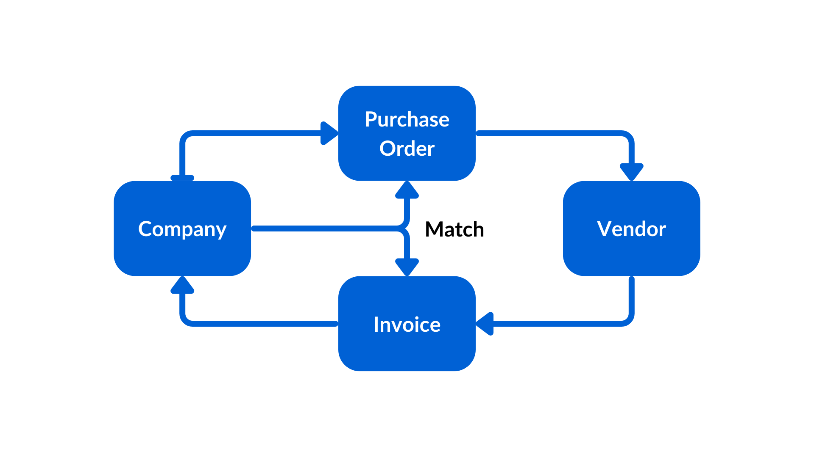

# Metadata
In the ever-evolving landscape of enterprise documents, metadata plays a pivotal role in organizing, discovering, and extracting value from unstructured content. 
In this workshop we will dive deep into metadata templates, creation, and extraction using the Box Platform API.

## Pre-requisites
At the moment the Box Metadata Suggestions API is only available via private beta. 
All the other Metadata related end points are available for use.
## Concepts
When working with Box Metadata there are quite a few concepts we need to keep in mind.
* **The Metadata Template** represents the structure of the data you want to associate to an unstructured document. Templates are created at enterprise level.
* A **Metadata Instance** represent the association of a template with a document or folder. You can also have multiple templates associated to a single document.
* Administrators can even create **Metadata Cascade Policies**, allowing a metadata instance to automatically be applied to the content of a folder.
For example, a user might assign the same `invoiceData` metadata template to a project folder allowing it to automatically apply to all the files and folders within that project folder.

The advantage of using metadata to provide structure to your content makes it much easier to create processes, integrations and workflows. Search also benefits from metadata making it much more accurate.

References to our documentation:
* [Guides](https://developer.box.com/guides/metadata/)
* API Reference
    * [Metadata templates](https://developer.box.com/reference/resources/metadata-template/)
    * [Metadata instances (Files)](https://developer.box.com/reference/resources/metadata/)
    * [Metadata instances (Folders)](https://developer.box.com/reference/get-folders-id-metadata/)
    * [Metadata cascade policies](https://developer.box.com/reference/resources/metadata-cascade-policy/)

# Use Case
To illustrate the usage of metadata we consider a simplified procurement process for an enterprise:



* A company issues a purchase order to a vendor for goods or services
* The vendor completes the order and sends an invoice to the company
* Company matches the invoice to the purchase order
* Company checks invoice, purchase order, goods or services received, and if all checks out issues a payment to vendor.

Typically the Vendor includes the purchase order number in the invoice, making life easier for the company to match with a purchase order, so they can complete the process.

We are going to use the Box Metadata APIs, to extract metadata from the invoice and purchase order, and figure out which ones do not match.

# Exercises
## Setup
Create a `metadata_init.py` file on the root of the project and execute the following code:
```python
"""upload sample content to box"""
import logging
from utils.box_client_oauth import ConfigOAuth, get_client_oauth

from workshops.metadata.create_samples import upload_content_sample

logging.basicConfig(level=logging.INFO)
logging.getLogger("box_sdk_gen").setLevel(logging.CRITICAL)

conf = ConfigOAuth()


def main():
    client = get_client_oauth(conf)
    upload_content_sample(client)


if __name__ == "__main__":
    main()
```
Result:
```yaml
INFO:root:Folder workshops with id: 260937698360
INFO:root:Folder metadata with id: 261452450320
INFO:root:Folder invoices with id: 261456614253
INFO:root: Folder invoices
INFO:root:      Uploaded Invoice-Q8888.txt (1517630440115) 185 bytes
INFO:root:      Uploaded Invoice-B1234.txt (1517619752941) 189 bytes
INFO:root:      Uploaded Invoice-C9876.txt (1517619788460) 210 bytes
INFO:root:      Uploaded Invoice-A5555.txt (1517632907985) 171 bytes
INFO:root:      Uploaded Invoice-Q2468.txt (1517629086517) 197 bytes
INFO:root:Folder purchase_orders with id: 261457585224
INFO:root: Folder purchase_orders
INFO:root:      Uploaded PO-001.txt (1517628618684) 212 bytes
INFO:root:      Uploaded PO-002.txt (1517626773559) 229 bytes
INFO:root:      Uploaded PO-003.txt (1517628291707) 222 bytes
INFO:root:      Uploaded PO-004.txt (1517625894126) 217 bytes
INFO:root:      Uploaded PO-005.txt (1517628697289) 211 bytes
```

Next, create a `metadata.py` file on the root of the project that you will use to write your code.
You can get the `INVOICE_FOLDER` and `PO_FOLDER` ids from the output of the previous script.
You can get the `ENTERPRISE_SCOPE` from the Box Admin Console -> Account & Billing -> Enterprise ID.


```python
import logging
from datetime import datetime
from typing import Dict, List

from box_sdk_gen import (
    AiResponseFull,
    BoxAPIError,
    CreateAiAskItems,
    CreateFileMetadataByIdScope,
    CreateMetadataTemplateFields,
    CreateMetadataTemplateFieldsOptionsField,
    CreateMetadataTemplateFieldsTypeField,
    MetadataTemplate,
    SearchByMetadataQueryOrderBy,
    SearchByMetadataQueryOrderByDirectionField,
    UpdateFileMetadataByIdRequestBody,
    UpdateFileMetadataByIdRequestBodyOpField,
    UpdateFileMetadataByIdScope,
)

from utils.box_ai_client_oauth import BoxAIClient, ConfigOAuth, get_ai_client_oauth
from utils.intelligence import ExtractStructuredMetadataTemplate

logging.getLogger("box_sdk_gen").setLevel(logging.CRITICAL)

INVOICE_FOLDER = "261456614253"
PO_FOLDER = "261457585224"
ENTERPRISE_SCOPE = "enterprise_1134207681"

def main():
    conf = ConfigOAuth()
    client = get_ai_client_oauth(conf)

    user = client.users.get_user_me()
    print(f"\nHello, I'm {user.name} ({user.login}) [{user.id}]")

if __name__ == "__main__":
    main()
```

Resulting in:

```yaml
Hello, I'm RB Admin (rbarbosa+devday@boxdemo.com) [31519033281]
```
## Create some helper functions
To make our life easier later, let's create some helper functions to interact with the Box API.

First, let's create a function to get a metadata template by key:

```python
def get_template_by_key(client: BoxAIClient, template_key: str) -> MetadataTemplate:
    """Get a metadata template by key"""

    scope = "enterprise"

    try:
        template = client.metadata_templates.get_metadata_template(scope=scope, template_key=template_key)
    except BoxAPIError as err:
        if err.response_info.status_code == 404:
            template = None
        else:
            raise err

    return template
```

Next, let's create a function to delete a metadata template by key, just in case we get stuck and need to start over:

```python
def delete_template_by_key(client: BoxAIClient, template_key: str):
    """Delete a metadata template by key"""

    scope = "enterprise"

    try:
        client.metadata_templates.delete_metadata_template(scope=scope, template_key=template_key)
    except BoxAPIError as err:
        if err.response_info.status_code == 404:
            pass
        else:
            raise err
```

## Create a metadata template

To be able to work with metadata we need a metadata template to define the metadata fields we want to use. 
Because metadata templates are common to the entire enterprise, use your initials as a prefix to the template key to avoid conflicts with other users.

Let's create a metadata template using this method:
```python
def create_invoice_po_template(client: BoxAIClient, template_key: str, display_name: str) -> MetadataTemplate:
    """Create a metadata template"""

    scope = "enterprise"

    fields = []

    # Document type
    fields.append(
        CreateMetadataTemplateFields(
            type=CreateMetadataTemplateFieldsTypeField.ENUM,
            key="documentType",
            display_name="Document Type",
            options=[
                CreateMetadataTemplateFieldsOptionsField(key="Invoice"),
                CreateMetadataTemplateFieldsOptionsField(key="Purchase Order"),
                CreateMetadataTemplateFieldsOptionsField(key="Unknown"),
            ],
        )
    )

    # Date
    fields.append(
        CreateMetadataTemplateFields(
            type=CreateMetadataTemplateFieldsTypeField.DATE,
            key="documentDate",
            display_name="Document Date",
        )
    )

    # Document total
    fields.append(
        CreateMetadataTemplateFields(
            type=CreateMetadataTemplateFieldsTypeField.STRING,
            key="total",
            display_name="Total: $",
            description="Total: $",
        )
    )

    # Supplier
    fields.append(
        CreateMetadataTemplateFields(
            type=CreateMetadataTemplateFieldsTypeField.STRING,
            key="vendor",
            display_name="Vendor",
            description="Vendor name or designation",
        )
    )

    # Invoice number
    fields.append(
        CreateMetadataTemplateFields(
            type=CreateMetadataTemplateFieldsTypeField.STRING,
            key="invoiceNumber",
            display_name="Invoice Number",
            description="Document number or associated invoice",
        )
    )

    # PO number
    fields.append(
        CreateMetadataTemplateFields(
            type=CreateMetadataTemplateFieldsTypeField.STRING,
            key="purchaseOrderNumber",
            display_name="Purchase Order Number",
            description="Document number or associated purchase order",
        )
    )

    template = client.metadata_templates.create_metadata_template(
        scope=scope,
        template_key=template_key,
        display_name=display_name,
        fields=fields,
    )

    return template
```

In the main function, let's check if the template already exists and if not, create it.

>Remember to update the template key and display name to match your initials.

```python
def main():
    ...

    # check if template exists
    template_key = "rbInvoicePO"
    template_display_name = "RB: Invoice & POs"
    template = get_template_by_key(client, template_key)

    if template:
        print(
            f"\nMetadata template exists: '{template.display_name}' ",
            f"[{template.id}]",
        )
    else:
        print("\nMetadata template does not exist, creating...")

        # create a metadata template
        template = create_invoice_po_template(
            client, template_key, template_display_name
        )
        print(
            f"\nMetadata template created: '{template.display_name}' ",
            f"[{template.id}]",
        )
```    
This results in:
```yaml
Hello, I'm Rui Barbosa (anovotny+rbarbosa@boxdemo.com) [31699333422]
Metadata template does not exist, creating...
Metadata template created: 'RB: Invoice & POs'  [2257ed5b-c4c3-48b1-9881-875b5291ddfa]
```

If you run the code again, you should see the message that the template already exists.
```yaml
Metadata template exists: 'RB: Invoice & POs'  [2257ed5b-c4c3-48b1-9881-875b5291ddfa]
```

## Scanning the content using the metadata suggestions

Create a method to scan the content and get metadata suggestions:

```python
def get_metadata_suggestions_for_file(
    client_ai: BoxAIClient, file_id: str, scope: str, template_key: str
) -> AiResponseFull:
    """Get metadata suggestions for a file"""

    item = CreateAiAskItems(id=file_id, type="file")
    metadata_template = ExtractStructuredMetadataTemplate(scope=scope, template_key=template_key)
    return client_ai.intelligence.extract_structured(items=[item], metadata_template=metadata_template)
```

Next add the following code to the main function to scan the content and get metadata suggestions:

```python
def main():
    ...

    # # Scan the purchase folder for metadata suggestions
    folder_items = client.folders.get_folder_items(PO_FOLDER)
    for item in folder_items.entries:
        print(f"\nItem: {item.name} [{item.id}]")
        ai_response = get_metadata_suggestions_for_file(client, item.id, ENTERPRISE_SCOPE, template_key)
        print(f"Suggestions: {ai_response.answer}")

```

Your results may vary, but in my case:
```yaml
Item: PO-001.txt [1517628618684]
Suggestions: {'documentDate': 'February 13, 2024', 'total': '$575', 'documentType': 'Purchase Order', 'vendor': 'Galactic Gizmos Inc.', 'purchaseOrderNumber': '001'}

Item: PO-002.txt [1517626773559]
Suggestions: {'documentDate': 'February 13, 2024', 'total': '$230', 'documentType': 'Purchase Order', 'vendor': 'Cosmic Contraptions Ltd.', 'purchaseOrderNumber': '002'}

Item: PO-003.txt [1517628291707]
Suggestions: {'documentDate': 'February 13, 2024', 'total': '$1,050', 'documentType': 'Purchase Order', 'vendor': 'Quasar Innovations', 'purchaseOrderNumber': '003'}

Item: PO-004.txt [1517625894126]
Suggestions: {'documentDate': 'February 13, 2024', 'total': '$920', 'documentType': 'Purchase Order', 'vendor': 'AstroTech Solutions', 'purchaseOrderNumber': '004'}

Item: PO-005.txt [1517628697289]
Suggestions: {'documentDate': 'February 13, 2024', 'total': '$45', 'documentType': 'Purchase Order', 'vendor': 'Quantum Quirks Co.', 'purchaseOrderNumber': '005'}
```

## Updating the content metadata
Now that we have the suggestions for the metadata, let's update the content metadata with the suggestions.

There are 3 things to consider here:
* We may not get a suggestion for all the fields, or we may get a `None` value. In this case we first set a default value and then merge the suggestions.
* The metadata template my not have yet been associated with the document, so we may have an error when trying to update the metadata.
* The update for the metadata is quite different than traditional updates. It supports operations such as add, replace, remove, test, move, and copy.

Create a method to update the content metadata:

```python
def convert_to_datetime(date_string):
    """
    Converts a date string in the format 'February 13, 2024' or '2024-03-13' to a datetime object.

    :param date_string: The date string to convert.
    :return: A datetime object or None if the format is not recognized.
    """
    # Define possible date formats
    date_formats = ["%B %d, %Y", "%Y-%m-%d"]

    for date_format in date_formats:
        try:
            # Attempt to parse the date string with the current format
            return datetime.strptime(date_string, date_format)
        except ValueError:
            # If parsing fails, continue to the next format
            continue

    # If none of the formats match, return None
    return None


def apply_template_to_file(client: BoxAIClient, file_id: str, template_key: str, data: Dict[str, str]):
    """Apply a metadata template to a folder"""
    default_data = {
        "documentType": "Unknown",
        "documentDate": "1900-01-01T00:00:00Z",
        "total": "Unknown",
        "vendor": "Unknown",
        "invoiceNumber": "Unknown",
        "purchaseOrderNumber": "Unknown",
    }

    # remove empty values
    data = {k: v for k, v in data.items() if v}

    # Check if data has a date
    if "documentDate" in data:
        try:
            date_string = data["documentDate"]
            date2 = convert_to_datetime(date_string)

            data["documentDate"] = date2.isoformat().replace("+00:00", "") + "Z"
        except ValueError as e:
            data["documentDate"] = "1900-01-01T00:00:00Z"
            print(f"Error converting date: {e}")

    # Merge the default data with the data
    data = {**default_data, **data}

    try:
        client.file_metadata.create_file_metadata_by_id(
            file_id=file_id,
            scope=CreateFileMetadataByIdScope.ENTERPRISE,
            template_key=template_key,
            request_body=data,
        )
    except BoxAPIError as error_a:
        if error_a.response_info.status_code == 409:
            # Update the metadata
            update_data = []
            for key, value in data.items():
                update_item = UpdateFileMetadataByIdRequestBody(
                    op=UpdateFileMetadataByIdRequestBodyOpField.ADD,
                    path=f"/{key}",
                    value=value,
                )
                update_data.append(update_item)
            try:
                client.file_metadata.update_file_metadata_by_id(
                    file_id=file_id,
                    scope=UpdateFileMetadataByIdScope.ENTERPRISE,
                    template_key=template_key,
                    request_body=update_data,
                )
            except BoxAPIError as error_b:
                logging.error(f"Error updating metadata: {error_b.status}:{error_b.code}:{file_id}")
        else:
            raise error_a
```

Next, update the following code to the main function to update the content metadata:

```python
def main():
    ...

    # Scan the purchase folder for metadata suggestions
    folder_items = client.folders.get_folder_items(PO_FOLDER)
    for item in folder_items.entries:
        print(f"\nItem: {item.name} [{item.id}]")
        suggestions = get_metadata_suggestions_for_file(
            client, item.id, ENTERPRISE_SCOPE, template_key
        )
        print(f"Suggestions: {suggestions.suggestions}")
        metadata = suggestions.suggestions
        apply_template_to_file(
            client,
            item.id,
            template_key,
            metadata,
        )
```
If you check the metadata for the purchase orders, you should see the metadata updated with the suggestions.

In the Box app navigate to workshops -> metadata -> purchase_orders and click one of the files. You should see the metadata updated with the suggestions on the right panel:


## Applying metadata to invoices
Add the following code to the main function to scan and apply the metadata to the invoices:

```python
def main():
    ...

    # # Scan the invoice folder for metadata suggestions
    folder_items = client.folders.get_folder_items(INVOICE_FOLDER)
    for item in folder_items.entries:
        print(f"\nItem: {item.name} [{item.id}]")
        ai_response = get_metadata_suggestions_for_file(client, item.id, ENTERPRISE_SCOPE, template_key)
        print(f"Suggestions: {ai_response.answer}")
        metadata = ai_response.answer
        apply_template_to_file(
            client,
            item.id,
            template_key,
            metadata,
        )
```

Resulting in:
```yaml
Item: Invoice-A5555.txt [1517632907985]
Suggestions: {'documentDate': '2024-03-13', 'invoiceNumber': 'A5555', 'total': '$920', 'documentType': 'Invoice', 'vendor': 'AstroTech Solutions'}

Item: Invoice-B1234.txt [1517619752941]
Suggestions: {'documentDate': '2024-03-13', 'invoiceNumber': 'B1234', 'total': '$575', 'documentType': 'Invoice', 'vendor': 'Galactic Gizmos Inc.', 'purchaseOrderNumber': '001'}

Item: Invoice-C9876.txt [1517619788460]
Suggestions: {'documentDate': '2024-03-13', 'invoiceNumber': 'C9876', 'total': '$230', 'documentType': 'Invoice', 'vendor': 'Cosmic Contraptions Ltd.', 'purchaseOrderNumber': '002'}

Item: Invoice-Q2468.txt [1517629086517]
Suggestions: {'documentDate': '2024-03-13', 'invoiceNumber': 'Q2468', 'total': '$1,050', 'documentType': 'Invoice', 'vendor': 'Quasar Innovations', 'purchaseOrderNumber': '003'}

Item: Invoice-Q8888.txt [1517630440115]
Suggestions: {'documentDate': '2024-03-13', 'invoiceNumber': 'Q8888', 'total': '$45', 'documentType': 'Invoice', 'vendor': 'Quantum Quirks Co.', 'purchaseOrderNumber': '005'}
```

## Getting metadata for a file
We can directly get the metadata for a file using the following method:

```python
def get_file_metadata(client: BoxAIClient, file_id: str, template_key: str):
    """Get file metadata"""
    metadata = client.file_metadata.get_file_metadata_by_id(
        file_id=file_id,
        scope=CreateFileMetadataByIdScope.ENTERPRISE,
        template_key=template_key,
    )
    return metadata
```
Let's test with the ID of one of the files we just updated:

```python
def main():
    ...

    # get metadata for a file
    metadata = get_file_metadata(client, folder_items.entries[0].id, template_key)
    print(f"\nMetadata for file: {metadata.extra_data}")
```

Resulting in:
```yaml
Metadata for file: {'invoiceNumber': 'A5555', 'vendor': 'AstroTech Solutions', 'documentDate': '2024-03-13T00:00:00.000Z', 'total': '$920', 'purchaseOrderNumber': 'Unknown', 'documentType': 'Invoice'}
```


## Finding unmatched invoices
We may have invoices that do not have a matching purchase order. Let's create a method to search in our metadata template:

```python
def search_metadata(
    client: BoxAIClient,
    template_key: str,
    folder_id: str,
    query: str,
    query_params: Dict[str, str],
    order_by: List[Dict[str, str]] = None,
):
    """Search for files with metadata"""

    from_ = ENTERPRISE_SCOPE + "." + template_key

    if order_by is None:
        order_by = [
            SearchByMetadataQueryOrderBy(
                field_key="invoiceNumber",
                direction=SearchByMetadataQueryOrderByDirectionField.ASC,
            )
        ]

    fields = [
        "type",
        "id",
        "name",
        "metadata." + from_ + ".invoiceNumber",
        "metadata." + from_ + ".purchaseOrderNumber",
    ]

    search_result = client.search.search_by_metadata_query(
        from_=from_,
        query=query,
        query_params=query_params,
        ancestor_folder_id=folder_id,
        order_by=order_by,
        fields=fields,
    )
    return search_result
```

And in our main, search for invoices that do not have a matching purchase order:

```python
def main():
    ...

    # # search for invoices without purchase orders
    query = "documentType = :docType AND purchaseOrderNumber = :poNumber"
    query_params = {"docType": "Invoice", "poNumber": "Unknown"}

    search_result = search_metadata(client, template_key, INVOICE_FOLDER, query, query_params)
    print(f"\nSearch results: {search_result.entries}")
```

Resulting in:
```yaml
Search results: [<class 'box_sdk_gen.schemas.file.File'> {'metadata': {'enterprise_1134207681': {'rbInvoicePO': {'$scope': 'enterprise_1134207681', '$template': 'rbInvoicePO', '$parent': 'file_1517632907985', 'purchaseOrderNumber': 'Unknown', 'invoiceNumber': 'A5555', '$version': 7}}}, 'id': '1517632907985', 'etag': '2', 'type': 'file', 'name': 'Invoice-A5555.txt'}]
```

It may take 10 to 15 minutes for the metadata to be indexed and available for search. If you don't see any results, wait a few minutes and try again.

## Extra credit
* Create a method that for each purchase order, finds the invoices that match the purchase order and updates the purchase order metadata with the invoice number.
* Create a method that for each invoice without purchase order, finds the purchase orders that match the invoice vendor without a purchase order.

## Final thoughts
Metadata is not just a technical detail, it's a strategic asset that can transform the way how your company works. 

Metadata templates enable maintaining consistency across the enterprise. Whether it's purchase orders, legal contracts, or creative assets, predefined templates streamline processes and minimize errors.

As your organization evolves, metadata becomes even more critical. Adaptability, integration with other systems, and maintaining a robust information architecture - all made possible by metadata.

Team members collaborating seamlessly because they understand the context behind each document. Metadata provides that context.


