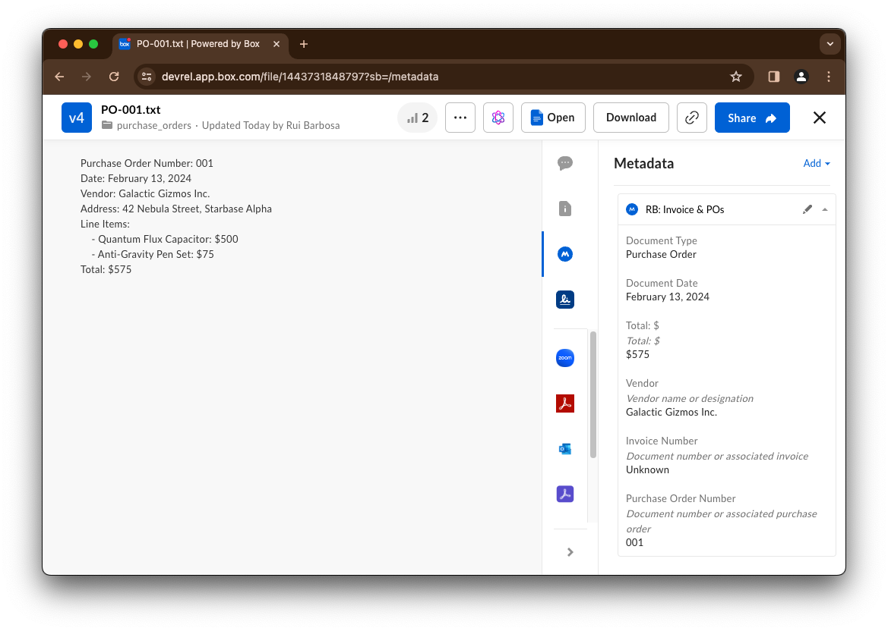

# Metadata


## Pre-requisites


## Concepts


References to our documentation:
* 

# Exercises
## Setup
Create a `metadata_init.py` file on the root of the project and execute the following code:
```python
"""upload sample content to box"""
import logging
from utils.box_client_oauth import ConfigOAuth, get_client_oauth

from workshops.metadata.create_samples import upload_content_sample

logging.basicConfig(level=logging.INFO)
logging.getLogger("box_sdk_gen").setLevel(logging.CRITICAL)

conf = ConfigOAuth()


def main():
    client = get_client_oauth(conf)
    upload_content_sample(client)


if __name__ == "__main__":
    main()
```
Result:
```yaml
INFO:root:Folder workshops with id: 248851586376
INFO:root:Folder metadata with id: 248847004564
INFO:root:Folder invoices with id: 248846701954
INFO:root: Folder invoices
INFO:root:      Uploaded Invoice-Q8888.txt (1443478591184) 158 bytes
INFO:root:      Uploaded Invoice-B1234.txt (1443446103636) 162 bytes
INFO:root:      Uploaded Invoice-C9876.txt (1443455423129) 183 bytes
INFO:root:      Uploaded Invoice-A5555.txt (1443449154029) 170 bytes
INFO:root:      Uploaded Invoice-Q2468.txt (1443455656177) 170 bytes
INFO:root:      Uploaded Invoice-W9999.txt (1443450068472) 173 bytes
INFO:root:      Uploaded Invoice-N7777.txt (1443446363085) 182 bytes
INFO:root:      Uploaded Invoice-N3333.txt (1443478787777) 147 bytes
INFO:root:      Uploaded Invoice-C1111.txt (1443478857049) 156 bytes
INFO:root:      Uploaded Invoice-A2222.txt (1443477560466) 160 bytes
INFO:root:Folder purchase_orders with id: 248852070443
INFO:root: Folder purchase_orders
INFO:root:      Uploaded PO-008.txt (1443446236634) 202 bytes
INFO:root:      Uploaded PO-009.txt (1443452445097) 183 bytes
INFO:root:      Uploaded PO-001.txt (1443479464395) 195 bytes
INFO:root:      Uploaded PO-002.txt (1443447637477) 212 bytes
INFO:root:      Uploaded PO-003.txt (1443452989216) 205 bytes
INFO:root:      Uploaded PO-007.txt (1443477075692) 193 bytes
INFO:root:      Uploaded PO-006.txt (1443455828977) 216 bytes
INFO:root:      Uploaded PO-010.txt (1443480075910) 188 bytes
INFO:root:      Uploaded PO-004.txt (1443453421426) 200 bytes
INFO:root:      Uploaded PO-005.txt (1443454854559) 194 bytes
```

Next, create a `metadata.py` file on the root of the project that you will use to write your code.
You can get the `INVOICE_FOLDER` and `PO_FOLDER` ids from the output of the previous script.
You can get the `ENTERPRISE_SCOPE` from the Box Admin Console -> Account & Billing -> Enterprise ID.


```python
import logging
from typing import Dict

from utils.box_ai_client import BoxAIClient as Client
from box_sdk_gen.fetch import APIException

from box_sdk_gen.schemas import MetadataTemplate
from utils.ai_schemas import IntelligenceMetadataSuggestions
from box_sdk_gen.managers.metadata_templates import (
    CreateMetadataTemplateFields,
    CreateMetadataTemplateFieldsTypeField,
    CreateMetadataTemplateFieldsOptionsField,
)

from box_sdk_gen.managers.file_metadata import (
    CreateFileMetadataByIdScope,
    UpdateFileMetadataByIdScope,
    UpdateFileMetadataByIdRequestBody,
    UpdateFileMetadataByIdRequestBodyOpField,
)

from utils.box_ai_client_oauth import ConfigOAuth, get_ai_client_oauth

logging.basicConfig(level=logging.INFO)
logging.getLogger("box_sdk_gen").setLevel(logging.CRITICAL)

INVOICE_FOLDER = "248887218023"
PO_FOLDER = "248891043873"
ENTERPRISE_SCOPE = "enterprise_1133807781"

def main():
    conf = ConfigOAuth()
    client = get_ai_client_oauth(conf)

    user = client.users.get_user_me()
    print(f"\nHello, I'm {user.name} ({user.login}) [{user.id}]")

if __name__ == "__main__":
    main()
```

Resulting in:

```yaml
Hello, I'm Rui Barbosa (barduinor@gmail.com) [18622116055]
```
## Create some helper functions
To make our life easier later, let's create some helper functions to interact with the Box API.

First, let's create a function to get a metadata template by key:

```python
def get_template_by_key(client: Client, template_key: str) -> MetadataTemplate:
    """Get a metadata template by key"""

    scope = "enterprise"

    try:
        template = client.metadata_templates.get_metadata_template(
            scope=scope, template_key=template_key
        )
    except APIException as e:
        if e.status == 404:
            template = None
        else:
            raise e

    return template
```

Next, let's create a function to delete a metadata template by key, just in case we get stuck and need to start over:

```python
def delete_template_by_key(client: Client, template_key: str):
    """Delete a metadata template by key"""

    scope = "enterprise"

    try:
        client.metadata_templates.delete_metadata_template(
            scope=scope, template_key=template_key
        )
    except APIException as e:
        if e.status == 404:
            pass
        else:
            raise e
```

## Create a metadata template

To be able to work with metadata we need a metadata template to define the metadata fields we want to use. 
Because metadata templates are common to the entire enterprise, use your initials as a prefix to the template key to avoid conflicts with other users.

Let's create a metadata template using this method:
```python
def create_invoice_po_template(
    client: Client, template_key: str, display_name: str
) -> MetadataTemplate:
    """Create a metadata template"""

    scope = "enterprise"

    fields = []

    # Document type
    fields.append(
        CreateMetadataTemplateFields(
            type=CreateMetadataTemplateFieldsTypeField.ENUM,
            key="documentType",
            display_name="Document Type",
            description="Identifies document as an invoice or purchase order",
            options=[
                CreateMetadataTemplateFieldsOptionsField(key="Invoice"),
                CreateMetadataTemplateFieldsOptionsField(key="Purchase Order"),
            ],
        )
    )

    # Date
    fields.append(
        CreateMetadataTemplateFields(
            type=CreateMetadataTemplateFieldsTypeField.DATE,
            key="documentDate",
            display_name="Document Date",
        )
    )

    # Document total
    fields.append(
        CreateMetadataTemplateFields(
            type=CreateMetadataTemplateFieldsTypeField.FLOAT,
            key="documentTotal",
            display_name="Document Total",
            description="Total USD value of document",
        )
    )

    # Supplier
    fields.append(
        CreateMetadataTemplateFields(
            type=CreateMetadataTemplateFieldsTypeField.STRING,
            key="vendor",
            display_name="Vendor",
            description="Vendor name or designation",
        )
    )

    # Invoice number
    fields.append(
        CreateMetadataTemplateFields(
            type=CreateMetadataTemplateFieldsTypeField.STRING,
            key="invoice",
            display_name="Invoice #",
            description="Document number or associated invoice",
        )
    )

    # PO number
    fields.append(
        CreateMetadataTemplateFields(
            type=CreateMetadataTemplateFieldsTypeField.STRING,
            key="po",
            display_name="PO #",
            description="Document number or associated purchase order",
        )
    )

    template = client.metadata_templates.create_metadata_template(
        scope=scope,
        template_key=template_key,
        display_name=display_name,
        fields=fields,
    )

    return template
```

In the main function, let's check if the template already exists and if not, create it.

>Remember to update the template key and display name to match your initials.

```python
def main():
    ...

    # check if template exists
    template_key = "rbInvoicePO"
    template_display_name = "RB: Invoice & POs"
    template = get_template_by_key(client, template_key)

    if template:
        print(
            f"\nMetadata template exists: '{template.display_name}' ",
            f"[{template.id}]",
        )
    else:
        print("\nMetadata template does not exist, creating...")

        # create a metadata template
        template = create_invoice_po_template(
            client, template_key, template_display_name
        )
        print(
            f"\nMetadata template created: '{template.display_name}' ",
            f"[{template.id}]",
        )
```    
This results in:
```yaml
Hello, I'm Rui Barbosa (anovotny+rbarbosa@boxdemo.com) [31699333422]
Metadata template does not exist, creating...
Metadata template created: 'RB: Invoice & POs'  [2257ed5b-c4c3-48b1-9881-875b5291ddfa]
```

If you run the code again, you should see the message that the template already exists.
```yaml
Metadata template exists: 'RB: Invoice & POs'  [2257ed5b-c4c3-48b1-9881-875b5291ddfa]
```

## Scanning the content using the metadata suggestions

Create a method to scan the content and get metadata suggestions:

```python
def get_metadata_suggestions_for_file(
    client: Client, file_id: str, enterprise_scope: str, template_key: str
) -> IntelligenceMetadataSuggestions:
    """Get metadata suggestions for a file"""
    return client.intelligence.intelligence_metadata_suggestion(
        item=file_id,
        scope=enterprise_scope,
        template_key=template_key,
        confidence="experimental",
    )
```

Next add the following code to the main function to scan the content and get metadata suggestions:

```python
def main():
    ...

    # Scan the purchase folder for metadata suggestions
    folder_items = client.folders.get_folder_items(PO_FOLDER)
    for item in folder_items.entries:
        print(f"\nItem: {item.name} [{item.id}]")
        suggestions = get_metadata_suggestions_for_file(
            client, item.id, ENTERPRISE_SCOPE, template_key
        )
        print(f"Suggestions: {suggestions.suggestions}")
```

Your results may vary, but in my case:
```yaml
Item: PO-001.txt [1443731848797]
Suggestions: {'documentType': 'Purchase Order', 'documentDate': '2024-02-13T00:00:00.000Z', 'vendor': 'Galactic Gizmos Inc.', 'invoiceNumber': None, 'purchaseOrderNumber': '001', 'total': '$575'}

Item: PO-002.txt [1443739645222]
Suggestions: {'documentType': 'Purchase Order', 'documentDate': '2024-02-13T00:00:00.000Z', 'total': '$230', 'vendor': 'Cosmic Contraptions Ltd.', 'invoiceNumber': None, 'purchaseOrderNumber': '002'}

Item: PO-003.txt [1443724777261]
Suggestions: {'documentType': 'Purchase Order', 'documentDate': '2024-02-13T00:00:00.000Z', 'total': '1,050', 'vendor': 'Quasar Innovations'}

Item: PO-004.txt [1443739415948]
Suggestions: {'documentType': 'Purchase Order', 'documentDate': '2024-02-13T00:00:00.000Z', 'vendor': 'AstroTech Solutions', 'invoiceNumber': None, 'purchaseOrderNumber': '004', 'total': '920'}

Item: PO-005.txt [1443724550074]
Suggestions: {'documentType': 'Purchase Order', 'documentDate': '2024-02-13T00:00:00.000Z', 'vendor': 'Quantum Quirks Co.', 'invoiceNumber': None, 'purchaseOrderNumber': '005'}
```

## Updating the content metadata
Now that we have the suggestions for the metadata, let's update the content metadata with the suggestions.

There are 3 things to consider here:
* We may not get a suggestion for all the fields, or we may get a `None` value. In this case we first set a default value and then merge the suggestions.
* The metadata template my not have yet been associated with the document, so we may have an error when trying to update the metadata.
* The update for the metadata is quite different than traditional updates. It supports operations such as add, replace, remove, test, move, and copy.

Create a method to update the content metadata:

```python
def apply_template_to_file(
    client: Client, file_id: str, template_key: str, data: Dict[str, str]
):
    """Apply a metadata template to a folder"""
    default_data = {
        "documentType": "Unknown",
        "documentDate": "1900-01-01T00:00:00Z",
        "total": "Unknown",
        "vendor": "Unknown",
        "invoiceNumber": "Unknown",
        "purchaseOrderNumber": "Unknown",
    }
    # remove empty values
    data = {k: v for k, v in data.items() if v}
    # Merge the default data with the suggestions
    data = {**default_data, **data}

    try:
        client.file_metadata.create_file_metadata_by_id(
            file_id=file_id,
            scope=CreateFileMetadataByIdScope.ENTERPRISE,
            template_key=template_key,
            request_body=data,
        )
    except APIException as error_a:
        if error_a.status == 409:
            # Update the metadata
            update_data = []
            for key, value in data.items():
                update_item = UpdateFileMetadataByIdRequestBody(
                    op=UpdateFileMetadataByIdRequestBodyOpField.ADD,
                    path=f"/{key}",
                    value=value,
                )
                update_data.append(update_item)
            try:
                client.file_metadata.update_file_metadata_by_id(
                    file_id=file_id,
                    scope=UpdateFileMetadataByIdScope.ENTERPRISE,
                    template_key=template_key,
                    request_body=update_data,
                )
            except APIException as error_b:
                logging.error(
                    f"Error updating metadata: {error_b.status}:{error_b.code}:{file_id}"
                )
        else:
            raise error_a
```

Next, update the following code to the main function to update the content metadata:

```python
def main():
    ...

    # Scan the purchase folder for metadata suggestions
    folder_items = client.folders.get_folder_items(PO_FOLDER)
    for item in folder_items.entries:
        print(f"\nItem: {item.name} [{item.id}]")
        suggestions = get_metadata_suggestions_for_file(
            client, item.id, ENTERPRISE_SCOPE, template_key
        )
        print(f"Suggestions: {suggestions.suggestions}")
        metadata = suggestions.suggestions
        apply_template_to_file(
            client,
            item.id,
            template_key,
            metadata,
        )
```
If you check the metadata for the purchase orders, you should see the metadata updated with the suggestions.

In the Box app navigate to workshops -> metadata -> purchase_orders and click one of the files. You should see the metadata updated with the suggestions on the right panel:



## Applying metadata to invoices
Add the following code to the main function to scan and apply the metadata to the invoices:

```python
def main():
    ...

    # Scan the invoice folder for metadata suggestions
    folder_items = client.folders.get_folder_items(INVOICE_FOLDER)
    for item in folder_items.entries:
        print(f"\nItem: {item.name} [{item.id}]")
        suggestions = get_metadata_suggestions_for_file(
            client, item.id, ENTERPRISE_SCOPE, template_key
        )
        print(f"Suggestions: {suggestions.suggestions}")
        metadata = suggestions.suggestions
        apply_template_to_file(
            client,
            item.id,
            template_key,
            metadata,
        )
```

Resulting in:
```yaml
Item: Invoice-A5555.txt [1443738625223]
Suggestions: {'documentType': 'Invoice', 'invoiceNumber': 'A5555', 'total': '920'}

Item: Invoice-B1234.txt [1443724064462]
Suggestions: {'documentType': 'Invoice', 'documentDate': None, 'total': '575', 'vendor': 'Galactic Gizmos Inc.', 'invoiceNumber': 'B1234', 'purchaseOrderNumber': '001'}

Item: Invoice-C9876.txt [1443729681339]
Suggestions: {'documentType': 'Invoice', 'invoiceNumber': 'C9876', 'purchaseOrderNumber': '002', 'total': '$230', 'vendor': 'Cosmic Contraptions Ltd.'}

Item: Invoice-Q2468.txt [1443721424754]
Suggestions: {'documentType': 'Invoice', 'documentDate': None, 'total': '1,050', 'vendor': 'Quasar Innovations', 'invoiceNumber': 'Q2468', 'purchaseOrderNumber': '003'}

Item: Invoice-Q8888.txt [1443719236185]
Suggestions: {'documentType': 'Invoice', 'invoiceNumber': 'Q8888', 'purchaseOrderNumber': '005', 'total': '$45', 'vendor': 'Quantum Quirks Co.'}
```

## Getting metadata for a file
We can directly get the metadata for a file using the following method:

```python
def get_file_metadata(client: Client, file_id: str, template_key: str):
    """Get file metadata"""
    metadata = client.file_metadata.get_file_metadata_by_id(
        file_id=file_id,
        scope=CreateFileMetadataByIdScope.ENTERPRISE,
        template_key=template_key,
    )
    return metadata
```
Let's test with the ID of one of the files we just updated:

```python
def main():
    ...

    # get metadata for a file
    metadata = get_file_metadata(client, "1443738625223", template_key)
    print(f"\nMetadata for file: {metadata.extra_data}")
```

Resulting in:
```yaml
Metadata for file: {'invoiceNumber': 'A5555', 'vendor': 'Unknown', 'documentType': 'Invoice', 'documentDate': '1900-01-01T00:00:00.000Z', 'purchaseOrderNumber': 'Unknown', 'total': '920'}
```


## Finding unmatched invoices
We may have invoices that do not have a matching purchase order. Let's create a method to search in our metadata template::

```python
def search_metadata(
    client: Client,
    template_key: str,
    folder_id: str,
    query: str,
    query_params: Dict[str, str],
    order_by: List[Dict[str, str]] = None,
):
    """Search for files with metadata"""

    from_ = ENTERPRISE_SCOPE + "." + template_key

    if order_by is None:
        order_by = [
            SearchByMetadataQueryOrderBy(
                field_key="invoiceNumber",
                direction=SearchByMetadataQueryOrderByDirectionField.ASC,
            )
        ]

    fields = [
        "type",
        "id",
        "name",
        "metadata." + from_ + ".invoiceNumber",
        "metadata." + from_ + ".purchaseOrderNumber",
    ]

    search_result = client.search.search_by_metadata_query(
        from_=from_,
        query=query,
        query_params=query_params,
        ancestor_folder_id=folder_id,
        order_by=order_by,
        fields=fields,
    )
    return search_result
```

And in our main, search for invoices that do not have a matching purchase order:

```python
def main():
    ...

    # search for invoices without purchase orders
    query = "documentType = :docType AND purchaseOrderNumber = :poNumber"
    query_params = {"docType": "Invoice", "poNumber": "Unknown"}

    search_result = search_metadata(
        client, template_key, INVOICE_FOLDER, query, query_params
    )
    print(f"\nSearch results: {search_result.entries}")
```

Resulting in:
```yaml
Search results: [{'metadata': {'enterprise_1133807781': {'rbInvoicePO': {'$scope': 'enterprise_1133807781', '$template': 'rbInvoicePO', '$parent': 'file_1443738625223', 'purchaseOrderNumber': 'Unknown', 'invoiceNumber': 'A5555', '$version': 11}}}, 'id': '1443738625223', 'type': 'file', 'etag': '3', 'name': 'Invoice-A5555.txt'}]
```

It may take 10 to 15 minutes for the metadata to be indexed and available for search. If you don't see any results, wait a few minutes and try again.


## Extra credit
* Create a method that for each purchase order, finds the invoices that match the purchase order and updates the purchase order metadata with the invoice number.
* Create a method that for each invoice without purchase order, finds the purchase orders that match the invoice vendor without a purchase order.


