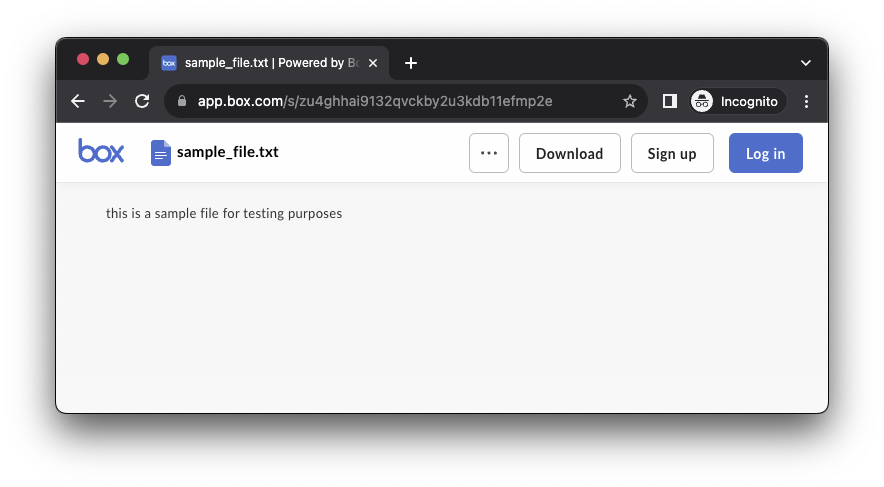
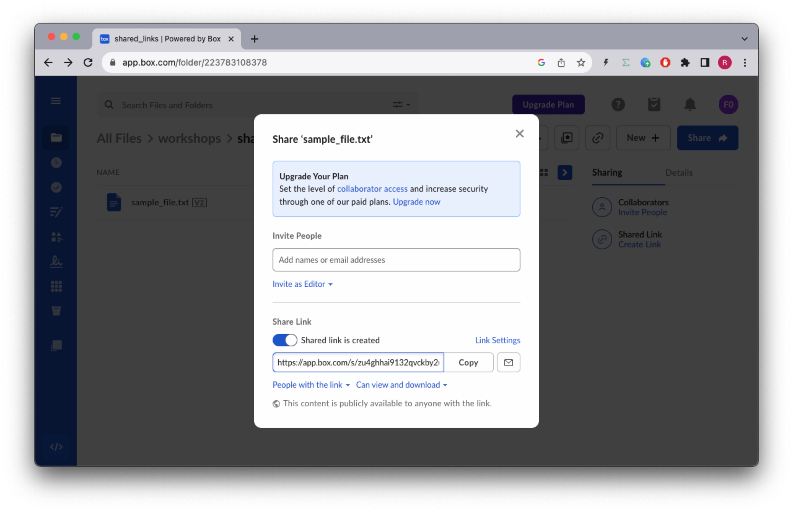
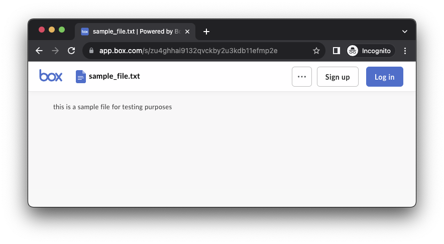
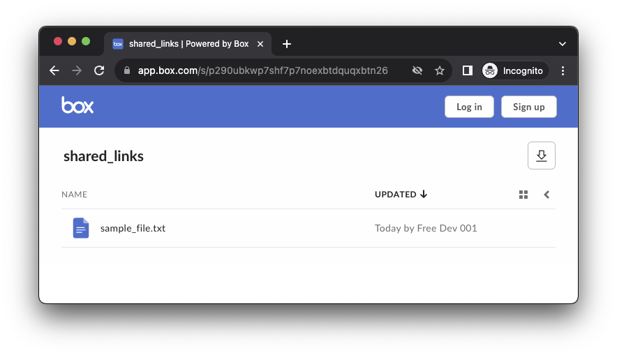
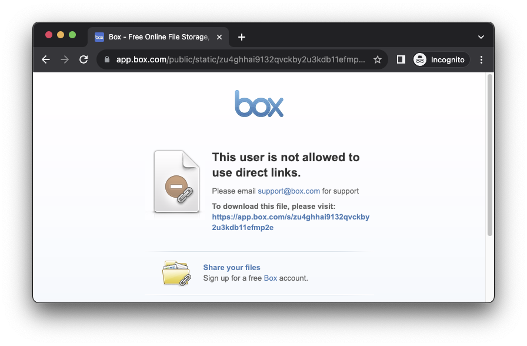

# Shared Links
Shared links are URLs that are generated for files, folders, web links stored in Box, which provide direct access to the resource.

Users can access shared items by entering the shared link URL in a browser. Applications can also access shared items using the Shared Item API.


## Concepts
Shared links have an `access level` which represents the typ of user tha can access the item:
* `open` - Anyone with the link can access the item
* `company` - Only users in the same enterprise can access the item
* `collaborators` - Only collaborators who have explicitly associated can access the item

Shared links have permissions which determine what actions can be performed on the item:
* `can_download` - The item can be downloaded
* `can_preview` - The item can be previewed
* `can_edit` - The item can be edited (files only)

Items can only have a single shared link at a time.

## Shared Links API
References to our documentation:
* [SDK Files](https://github.com/box/box-python-sdk-gen/blob/main/docs/shared_links_files.md)
* [SDK Folders](https://github.com/box/box-python-sdk-gen/blob/main/docs/shared_links_folders.md)
* [API Guide](https://developer.box.com/guides/shared-links/)
* [API Reference Files](https://developer.box.com/reference/get-shared-items/)
* [API Reference Folders](https://developer.box.com/reference/get-folders-id--get-shared-link/)


# Exercises
## Setup
Create a `shared_links_init.py` file on the root of the project and execute the following code:
```python
"""create sample content to box"""
import logging
from utils.box_client_oauth import ConfigOAuth, get_client_oauth

from workshops.shared_links.create_samples import create_samples

logging.basicConfig(level=logging.INFO)
logging.getLogger("box_sdk_gen").setLevel(logging.CRITICAL)

conf = ConfigOAuth()


def main():
    client = get_client_oauth(conf)
    create_samples(client)


if __name__ == "__main__":
    main()

```
Result:
```yaml
INFO:root:Folder workshops with id: 223095001439
INFO:root:Folder shared_links with id: 223783108378
INFO:root:      Uploaded sample_file.txt (1293174201535) 42 bytes
```

Next, create a `shared_links.py` file on the root of the project that you will use to write your code.
Create a global constant named `SHARED_LINKS_ROOT` and make it equal to the id of the `shared_links` folder, in my case `223783108378`
Create a global constant named `SAMPLE_FILE` and make it equal to the id of the `sample_file.txt` file, in my case `1293174201535`

```python
"""Box Shared links"""

import logging
from box_sdk_gen.client import BoxClient as Client
from box_sdk_gen.schemas import File, Folder
from box_sdk_gen.managers.shared_links_files import (
    AddShareLinkToFileSharedLink,
    AddShareLinkToFileSharedLinkAccessField,
    AddShareLinkToFileSharedLinkPermissionsField,
)
from box_sdk_gen.managers.shared_links_folders import (
    AddShareLinkToFolderSharedLink,
    AddShareLinkToFolderSharedLinkAccessField,
    AddShareLinkToFolderSharedLinkPermissionsField,
)

# from box_sdk_gen.managers.shared_links_folders

from utils.box_client_oauth import ConfigOAuth, get_client_oauth

logging.basicConfig(level=logging.INFO)
logging.getLogger("box_sdk_gen").setLevel(logging.CRITICAL)


SHARED_LINKS_ROOT = "223783108378"
SAMPLE_FILE = "1293174201535"


def main():
    """Simple script to demonstrate how to use the Box SDK"""
    conf = ConfigOAuth()
    client = get_client_oauth(conf)

    user = client.user().get()
    print(f"\nHello, I'm {user.name} ({user.login}) [{user.id}]")


if __name__ == "__main__":
    main()
```

## Create or update the shared link for a file
Create a method to update the shared link for a file.
The `company` access level is only available to paid accounts.
The `allow_download` can only be used if the `access` is `open` or `company`
```python
def file_shared_link_update(
    client: Client,
    file_id: str,
    shared_link_args: AddShareLinkToFileSharedLink,
) -> File:
    return client.shared_links_files.add_share_link_to_file(
        file_id=file_id, shared_link=shared_link_args, fields=["shared_link"]
    )
```
Then use it in your main method:
``` python
def main():
    ...

    # Make sure file exists
    file = client.files.get_file_by_id(SAMPLE_FILE)

    # Create or update the shared link for a file
    shared_link_args = AddShareLinkToFileSharedLink(
        access=AddShareLinkToFileSharedLinkAccessField.OPEN,
        permissions=AddShareLinkToFileSharedLinkPermissionsField(
            can_download=True,
            can_preview=True,
        ),
    )
    file_shared_link = file_shared_link_update(
        client,
        SAMPLE_FILE,
        shared_link_args,
    )
    print(f"\nShared link for {file.name}: {file_shared_link.shared_link}")
```
Resulting in:
```yaml
Shared link for sample_file.txt: <class 'box_sdk_gen.schemas.FileSharedLinkField'> {'url': 'https://app.box.com/s/kbx32aep6z11brckbnkkapt1h8h0eu49', 'effective_access': 'open', 'effective_permission': 'can_download', 'is_password_enabled': False, 'download_count': 0, 'preview_count': 0, 'download_url': 'https://app.box.com/shared/static/kbx32aep6z11brckbnkkapt1h8h0eu49.txt', 'access': 'open', 'permissions': {'can_download': True, 'can_preview': True, 'can_edit': False}}
```

Now try to open an incognito window and paste the link, you should be able to download the file.


Then in a normal browser window open box.com, navigate to the `/workshops/shared_links` and click the shared link icon on the file.



## Implementing permissions
Let's make a new request to create a shared link with that only allows viewing.
```python
def main():
    ...

    # Updating permissions
    shared_link_args = AddShareLinkToFileSharedLink(
        access=AddShareLinkToFileSharedLinkAccessField.OPEN,
        permissions=AddShareLinkToFileSharedLinkPermissionsField(
            can_download=False,
            can_preview=True,
        ),
    )
    file_shared_link = file_shared_link_update(
        client,
        SAMPLE_FILE,
        shared_link_args,
    )
    print(f"\nShared link for {file.name}: {file_shared_link.shared_link}")
```
Resulting in:
```yaml
Shared link for sample_file.txt: <class 'box_sdk_gen.schemas.FileSharedLinkField'> {'url': 'https://app.box.com/s/kbx32aep6z11brckbnkkapt1h8h0eu49', 'effective_access': 'open', 'effective_permission': 'can_preview', 'is_password_enabled': False, 'download_count': 0, 'preview_count': 0, 'download_url': 'https://app.box.com/shared/static/kbx32aep6z11brckbnkkapt1h8h0eu49.txt', 'access': 'open', 'permissions': {'can_download': False, 'can_preview': True, 'can_edit': False}}
```

Note that the shared link url did not change, and if you refresh your incognito browser, the download button should disappear.


## Create or update the shared link for a folder
Let's implement the same functionality for folders.
The `company` access level is only available to paid accounts.
The `allow_download` can only be used if the `access` is `open` or `company`

```python
def folder_shared_link_update(
    client: Client,
    folder_id: str,
    shared_link_args,
) -> Folder:
    return client.shared_links_folders.add_share_link_to_folder(
        folder_id=folder_id,
        shared_link=shared_link_args,
        fields=["shared_link"],
    )
```
Test this by creating a shared link for the `SHARED_LINKS_ROOT` folder.
```python
def main():
    ...

    # Make sure the folder exists
    folder = client.folders.get_folder_by_id(SHARED_LINKS_ROOT)

    # Create or update the shared link for a folder
    shared_link_args = AddShareLinkToFolderSharedLink(
        access=AddShareLinkToFolderSharedLinkAccessField.OPEN,
        permissions=AddShareLinkToFolderSharedLinkPermissionsField(
            can_download=True,
            can_preview=True,
        ),
    )
    folder_shared_link = folder_shared_link_update(
        client, SHARED_LINKS_ROOT, shared_link_args
    )
    print(f"\nShared link for {folder.name}: {folder_shared_link.shared_link}")
```
Resulting in:
```yaml
Shared link for shared_links: <class 'box_sdk_gen.schemas.FolderSharedLinkField'> {'url': 'https://app.box.com/s/p290ubkwp7shf7p7noexbtdquqxbtn26', 'effective_access': 'open', 'effective_permission': 'can_download', 'is_password_enabled': False, 'download_count': 0, 'preview_count': 0, 'access': 'open', 'permissions': {'can_download': True, 'can_preview': True, 'can_edit': False}}
```
Again test the folder shared link on your incognito browser:


## Downloadable shared link
Files also have a direct download shared link url, which can be used to download the file directly.
Update your main method to update the shared link file to alow downloads and print the download url for the file.
```python
def main():
    ...

    # Updating permissions
    shared_link_args = AddShareLinkToFileSharedLink(
        access=AddShareLinkToFileSharedLinkAccessField.OPEN,
        permissions=AddShareLinkToFileSharedLinkPermissionsField(
            can_download=True,
            can_preview=True,
        ),
    )
    file_shared_link = file_shared_link_update(
        client,
        SAMPLE_FILE,
        shared_link_args,
    )
    print(
        f"\nDownload URL for {file.name}: ",
        f"{file_shared_link.shared_link.download_url}",
    )
```
Resulting in:
```yaml
Download URL for sample_file.txt: https://app.box.com/shared/static/kbx32aep6z11brckbnkkapt1h8h0eu49.txt
```
Now you can open this last url in your incognito browser and the file will be downloaded directly.
If you get an error similar to:

This is a configuration your Box admin can set that affects the general configuration.
If you're using a free account you will not be able to change these options.

## Item from Shared Link
We can find out what object type and id a shared link is pointing to.
Let's create methods to do this:
```python
def file_from_shared_link(
    client: Client, link: str, password: str = None
) -> File:
    box_api = f"shared_link={link}&shared_link_password={password}"
    return client.shared_links_files.find_file_for_shared_link(box_api)


def folder_from_shared_link(
    client: Client, link: str, password: str = None
) -> Folder:
    box_api = f"shared_link={link}&shared_link_password={password}"
    return client.shared_links_folders.find_folder_for_shared_link(box_api)
```
And test it in your main method:
```python
def main():
    ...

    # Item from Shared Link
    item_a = file_from_shared_link(client, file_shared_link.shared_link.url)
    print(
        f"\nItem from shared link: {item_a.name} is a ",
        f"{item_a.type.value} ({item_a.id})",
    )

    item_b = folder_from_shared_link(
        client, folder_shared_link.shared_link.url
    )
    print(
        f"\nItem from shared link: {item_b.name} is a ",
        f"{item_b.type.value} ({item_b.id})",
    )
```
Resulting in:
```yaml
Item from shared link: sample_file.txt is a file (1293174201535)

Item from shared link: shared_links is a folder (223783108378)
```

## Extra Credit
There are a few more things you can do with shared links:
* Create a method to remove a shared link
* Update the `file_shared_link` method to accept the `password`, `unshared_at`, and `vanity_name` parameter
* Update the `folder_shared_link` method to accept the `password`, `unshared_at`, and `vanity_name` parameter
* Create a method that accepts a shared link url and downloads the item if it is a file.

# Final thoughts
Shared links are a great way to share content with users that are not part of your enterprise.
They can also be used to share content with users that are part of your enterprise without concerns if the share link end up in the hands of the wrong audience..


