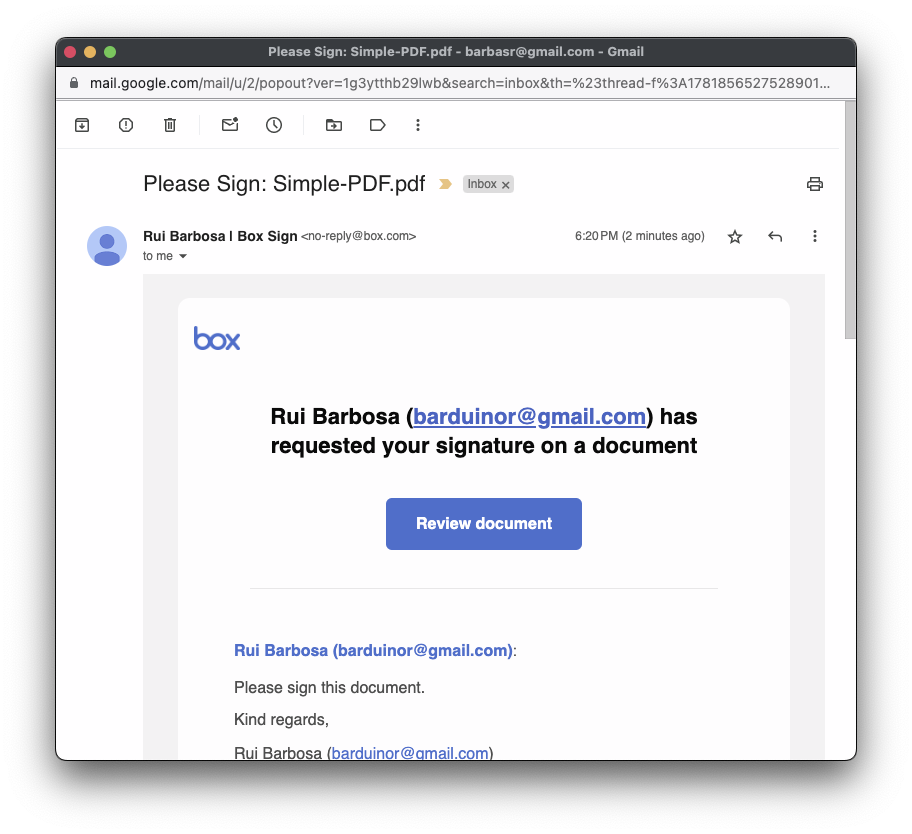
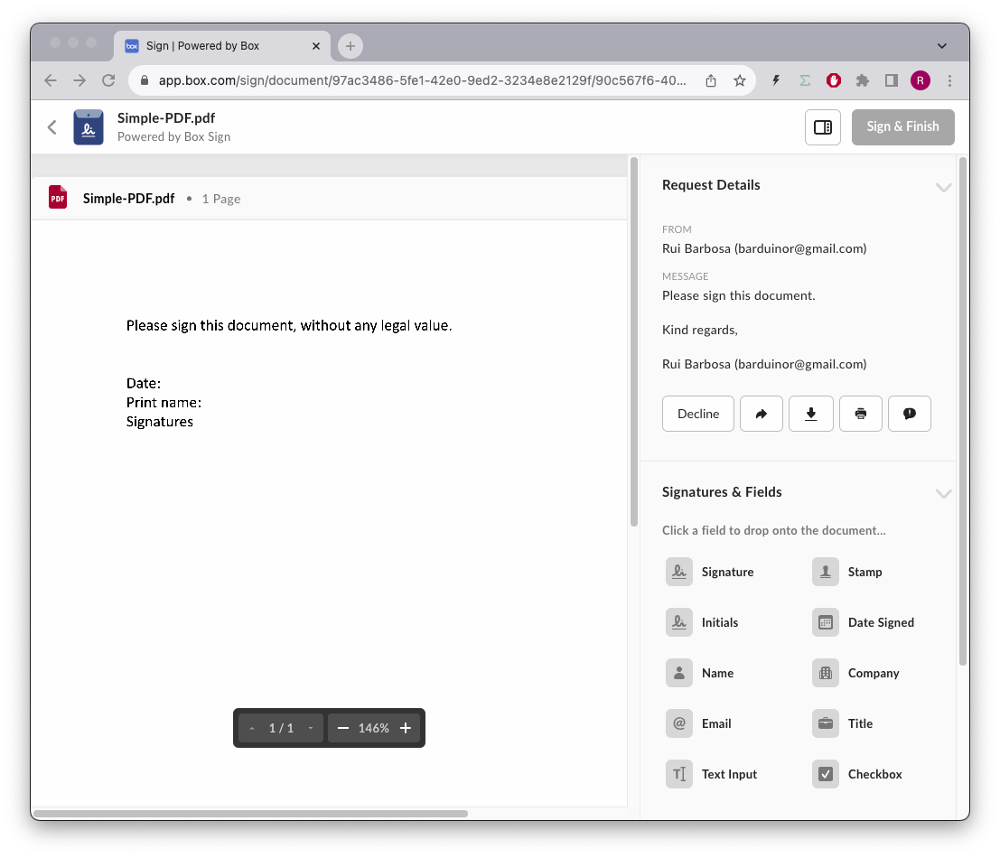
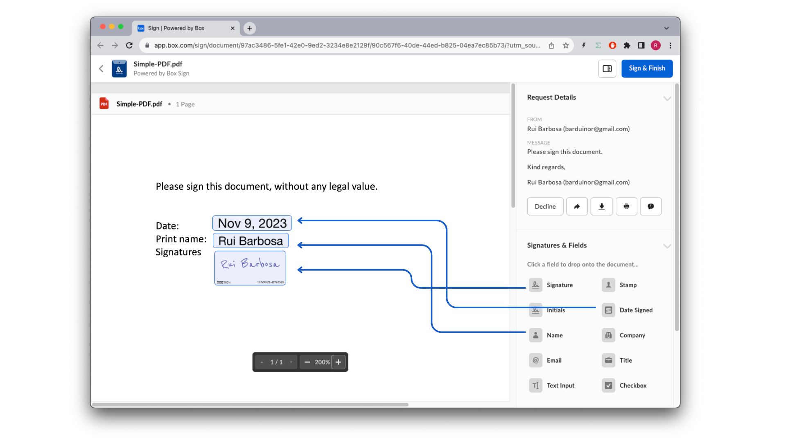
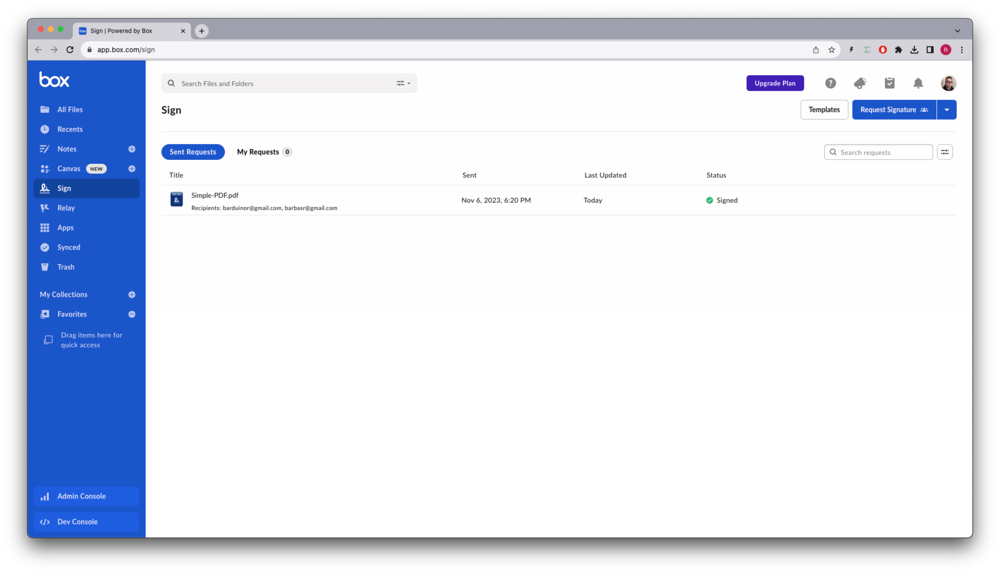
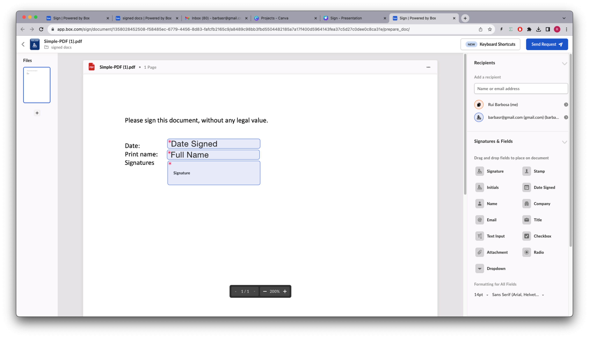
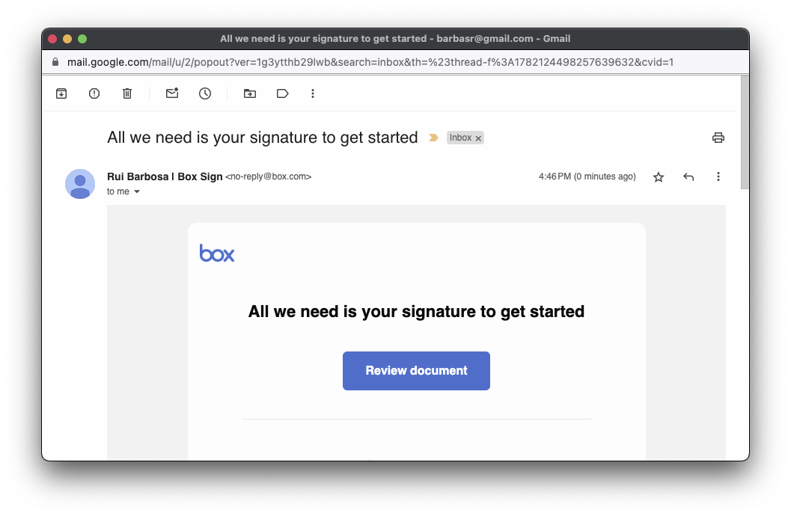
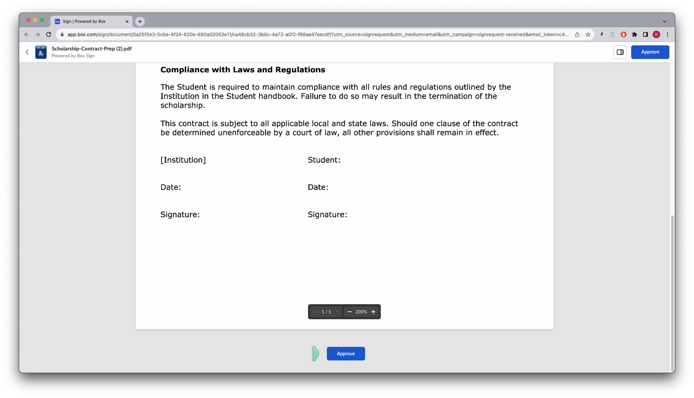
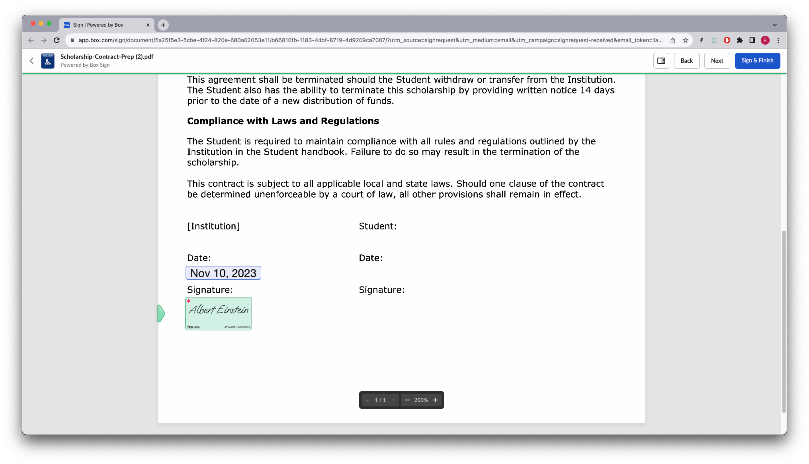
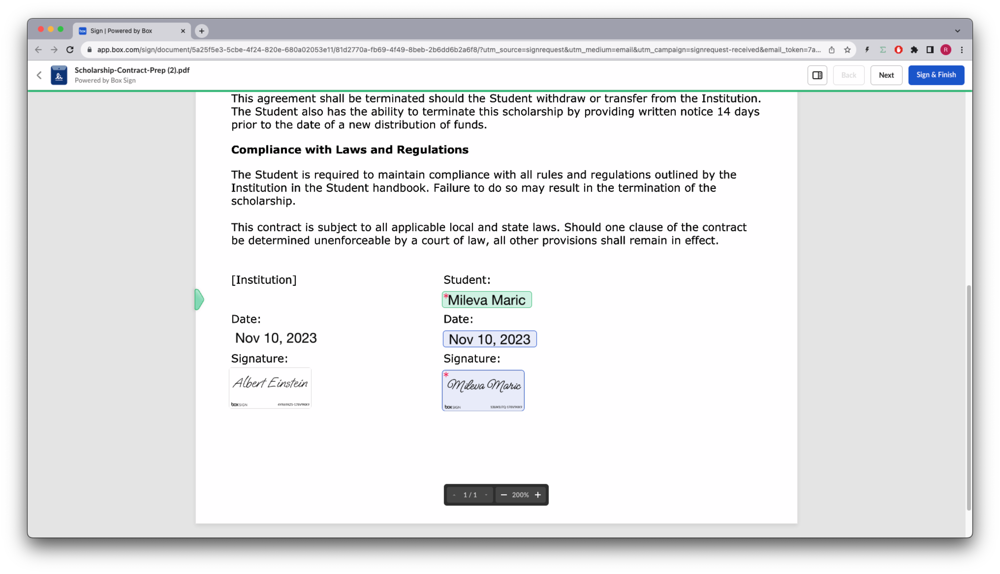

# Sign

## Pre-requisites
Make sure your Box app is configured to use the following scopes:


> ### Note
> If the application scope is not available, then your account can not use the Sign API and you wont be able to complete this exercise.

## Concepts
Box Sign enables you to send documents to people for electronic signatures.  With Box Sign, you select who needs to sign, select the order in which people need to sign, and include additional fields such as date of signature, explanatory text, and checkboxes.

To receive and sign documents, recipients do not need to have Box accounts — anyone with an email address can receive and sign the documents you send.

In this exercise we'll be covering signing unstructured documents.

Imagine some sort of document management app, where users can upload a document and ask anyone to sign it. In this case your app will know what document to sign and who needs to sign, but it has no idea where to put the signature or its properties like name, date, initial, and so on.

## Sign API
References to our documentation:
* [SDK Sign](https://github.com/box/box-python-sdk-gen/blob/main/docs/sign_requests.md)
* [API Guide](https://developer.box.com/guides/box-sign/)
* [API Reference ](https://developer.box.com/reference/resources/sign-request/)
* [Sign Guide](https://support.box.com/hc/en-us/articles/4404105810195-Sending-a-document-for-signature)

# Exercises
## Setup
Create a `sign_init.py` file on the root of the project and execute the following code:
```python
"""create sample content to box"""
import logging
from utils.box_client_oauth import ConfigOAuth, get_client_oauth

from workshops.sign.create_samples import create_samples

logging.basicConfig(level=logging.INFO)
logging.getLogger("box_sdk_gen").setLevel(logging.CRITICAL)

conf = ConfigOAuth()


def main():
    client = get_client_oauth(conf)
    create_samples(client)


if __name__ == "__main__":
    main()
```
Result:
```
INFO:root:Folder workshops with id: 234108232105
INFO:root:Folder sign with id: 234103953351
INFO:root:Folder signed docs with id: 234102987614
INFO:root:Folder docs with id: 234103761574
INFO:root:      Uploaded Simple-PDF.pdf (1355143830404) 17639 bytes
INFO:root:      Uploaded Scholarship-Contract-Prep.docx (1358047520478) 16365 bytes
INFO:root:      Uploaded Simple-DOC.docx (1358077513913) 12409 bytes
```

Next, create a `sign.py` file on the root of the project that you will use to write your code.
Take note of the above document id's and include statics for them in the doc.
Replace the `YOUR_EMAIL` with your email, or use a different email for each signer.

```python
"""Box Shared links"""
import logging

from utils.box_client_oauth import ConfigOAuth, get_client_oauth
from box_sdk_gen.schemas import (
    SignRequestCreateSigner,
    FileBaseTypeField,
    FolderBaseTypeField,
    FileBase,
    FolderMini,
)

logging.basicConfig(level=logging.INFO)
logging.getLogger("box_sdk_gen").setLevel(logging.CRITICAL)

SIGN_DOCS_FOLDER = "234102987614"

SIMPLE_PDF = "1355143830404"
SIMPLE_DOC = "1358077513913"
CONTRACT = "1358047520478"

SIGNER_A = "YOUR_EMAIL+A@gmail.com"
SIGNER_A_PHONE = "+15554443322"

SIGNER_B = "YOUR_EMAIL+B@gmail.com"

APPROVER = "YOUR_EMAIL+APPROVER@gmail.com"
FINAL_COPY = "YOUR_EMAIL+FINAL_COPY@gmail.com"

def check_sign_request(sign_request: SignRequest):
    print(f"\nSimple sign request: {sign_request.id}")
    print(f"  Status: {sign_request.status.value}")
    print(f"  Signers: {sign_request.signers[0].email}")
    print(f"  Prepare url: {sign_request.prepare_url}")


def main():
    """Simple script to demonstrate how to use the Box SDK"""
    conf = ConfigOAuth()
    client = get_client_oauth(conf)

    user = client.users.get_user_me()
    print(f"\nHello, I'm {user.name} ({user.login}) [{user.id}]")


if __name__ == "__main__":
    main()
```
Resulting in:
```
Hello, I'm Rui Barbosa  [18622116055]
```

## Sign a document
Imagine you need to have adhoc documents signed by a single person. 

These documents are typically not structured, the signature requirements and placement vary from document to document. 

Create a method to sign a document with a single signer:
```python
def sign_doc_single(
    client: Client,
    document_id: str,
    destination_folder_id: str,
    signer_email: str,
    prep_needed: bool = False,
) -> SignRequest:
    """Single doc sign by single signer"""

    # Sign request params
    source_file = FileBase(id=document_id, type=FileBaseTypeField.FILE)
    destination_folder = FolderMini(
        id=destination_folder_id, type=FolderBaseTypeField.FOLDER
    )
    signer = SignRequestCreateSigner(signer_email)
    # sign document
    sign_request = client.sign_requests.create_sign_request(
        signers=[signer],
        parent_folder=destination_folder,
        source_files=[source_file],
        is_document_preparation_needed=prep_needed,
    )

    return sign_request
```
And use it in the main method. In my case I'm using a different email for the signer from the one I'm in my Box account. Use an email that you have access to:
```python
def main():
    ...

    # Simple sign a pdf request
    sign_pdf = sign_doc_single(client, SIMPLE_PDF, SIGN_DOCS_FOLDER, SIGNER_A)
    check_sign_request(sign_pdf)
```

Resulting in:

```
Simple sign request: 97ac3486-5fe1-42e0-9ed2-3234e8e2129f
  Status: converting
  Signers: ...@gmail.com
  Prepare url: None
```
In the mean time check your Box Sign app and you should see something like this:

Feel free to inspect the details of the sign request.

You should have also received an email with the sign request:


Lets sign the document. Click on the link, click accept and continue, and you should see something like this:



To be able to complete the sign process, you need to at least drag a signature pad into your document:



Go ahead, click the `Sign & Finish button` to complete the sign process.

Back to your Box.com account under Sign you should see the updated status (you might need to refresh the page):



In your signed docs folder you now have the signed pdf and the signature details log:


Go ahead and explore the details of the documents.

You probably noticed that the application is forcing the signer to correctly place the signature pad in the document, hopefully in the right place, and also the rest of the signature requirements like `full name` and `signature date`.

This is not ideal.

## Sign a document with preparation
For these unstructured document your app can require a document preparation so that the `sender` can define the signature requirements and placement.

This way when the `signer` receives the sign request, the document is already prepared and the signer only needs to sign the document.

Comment your previous section of code and add a section on you main for this:
```python
def main()
    ...
    # # Simple sign a pdf request
    # sign_pdf = sign_doc_single(
    ...

    # Simple sign a pdf request with preparation
    sign_pdf_prep = sign_doc_single(
        client, SIMPLE_PDF, SIGN_DOCS_FOLDER, SIGNER_A, True
    )
    check_sign_request(sign_pdf_prep)
    if sign_pdf_prep.prepare_url is not None:
        open_browser(sign_pdf_prep.prepare_url)
```

Resulting in:
```
Simple sign request with prep: 1358028452508-f58485ec-6779-4456-8d83-fafcfb2165c9
  Status: converting
  Signers: ...@gmail.com
  Prepare url: https://app.box.com/sign/document/1358028452508-f58485ec-6779-4456-8d83-fafcfb2165c9/a8489c98bb3fbd5504482185a7a17f400d5964143fea37c5d27c0dee0c8ca31e/prepare_doc/
```

And your browser should open with the document preparation page.
Like before, drag the signature pad, the full name and the date to the appropriate places in the document, and click `Send Request`:



After the signer receives the email and opens the sign request, the document is already prepared and the signer only needs to sign the document:


Go ahead complete the sign process, and check your `Sign` status and the signed docs folder.

## Multiple signers
What if you have a document that needs to be signed by multiple people? This is typical of contracts between two or more entities.

Having multiple `signers` introduces another dimension to the sign process, the order in which the signers need to sign the document.

If you do not specify the order, the request is sent to everyone at the same time, and when all parties signed the document, they receive a copy with all signatures.

If you specify the order, the send request is sent to the first signer, and only when the first signer signs the document, the request is sent to the second signer, and so on.

Let's see this working with an example contract between an university and a student for a scholarship. In this case the institution must sign first.

Let create a method specific for this:

```python
def sign_contract(
    client: Client,
    document_id: str,
    destination_folder_id: str,
    institution_email: str,
    student_email: str,
    prep_needed: bool = False,
) -> SignRequest:
    """Sign contract"""

    # Sign request params
    source_file = FileBase(id=document_id, type=FileBaseTypeField.FILE)
    destination_folder = FolderMini(
        id=destination_folder_id, type=FolderBaseTypeField.FOLDER
    )

    # signers
    institution = SignRequestCreateSigner(
        email=institution_email,
        role=SignRequestCreateSignerRoleField.SIGNER,
        order=1,
    )

    student = SignRequestCreateSigner(
        email=student_email,
        role=SignRequestCreateSignerRoleField.SIGNER,
        order=2,
    )

    # create sign request
    sign_request = client.sign_requests.create_sign_request(
        signers=[institution, student],
        parent_folder=destination_folder,
        source_files=[source_file],
        is_document_preparation_needed=prep_needed,
    )

    return sign_request
```

And use it in the main method:
```python
def main():
    ...

    # Multiple signers
    sign_contract_multi = sign_contract(
        client,
        CONTRACT,
        SIGN_DOCS_FOLDER,
        institution_email=SIGNER_A,
        student_email=SIGNER_B,
        prep_needed=True,
    )
    if sign_contract_multi.prepare_url is not None:
        open_browser(sign_contract_multi.prepare_url)
```
You browser should open with the document preparation page. 

Notice you now have two signers, with the order already specified. The color is also important to identify which signer is which (in this case the institution is blue and the student is green), determining which signer pad, name and date belongs to which signer.

Like before, drag the signature pad, the full name and the date to the appropriate places in the document, and click `Send Request`:


If you look at the sign request details, you should see something like this:


Indicating that the first request was sent, but the second is waiting for the first to be completed.

Go ahead and complete the sign process for both signers.

Notice that when you get the second request it is already signed by the first signer.

## Resend sign requests
What if the signer did not receive the email? Or the email was lost? Or the signer deleted the email by mistake?

You can resend the sign request email to the `signer`, either manually or turn on the automatic resend option.

The automatic resend option sends a reminder email to the `signers` that have not signed the document yet, after 3, 8, 13, and 18 days.

You can also manually resend the sign request email to the signer, by calling the `resend_sign_request` method on the `sign_requests` object.
>This can only be done once every 10 minutes.

### Manually sending a reminder
Let's see how this is done. Add the following code:
```python
def sign_send_reminder(client: Client, sign_request_id: str):
    """Send reminder to signers"""
    sign_request = client.sign_requests.resend_sign_request(sign_request_id)
    return sign_request
```
It is difficult to test this in our workshop since we would need to wait at least 10 minutes to resend the sign request.

You can however take note of the sign request id and use it in postman later.

### Automatic resend
To enable automatic resend all you need to do is set the `are_reminders_enabled` parameter to `True`.
For example:
```python
def sign_doc_single_more_options(
    client: Client,
    document_id: str,
    destination_folder_id: str,
    signer_email: str,
    prep_needed: bool = False,
    auto_reminder: bool = False,
) -> SignRequest:
    """Single doc sign by single signer"""

    # Sign request params
    source_file = FileBase(id=document_id, type=FileBaseTypeField.FILE)
    destination_folder = FolderMini(
        id=destination_folder_id, type=FolderBaseTypeField.FOLDER
    )

    # signer
    signer = SignRequestCreateSigner(signer_email)

    # sign document
    sign_request = client.sign_requests.create_sign_request(
        signers=[signer],
        parent_folder=destination_folder,
        source_files=[source_file],
        is_document_preparation_needed=prep_needed,
        are_reminders_enabled=auto_reminder,
    )

    return sign_request
```

## Sign request expiration
There are situations where you might need to set an expiration date for the sign request. 

For example, imagine a quote for a service that is valid for 30 days. This proposal has to be signed by a certain date, and if not, the sign request is no longer valid.

All you need todo is pass the `days_valid` parameter to the `create_sign_request` method.

For example:
```python
def sign_doc_single_more_options(
    ...

    days_valid: int = None,
) -> SignRequest:
    ...

    # sign document
    sign_request = client.sign_requests.create_sign_request(
        ...

        days_valid=days_valid,
    )

    return sign_request
```

## Customizing redirect URL's
When the sign process is completed, the signer is redirected to a default page. The same happens when the signer `declines` the sign request.

We can customize these pages by passing the `redirect_url` and `decline_redirect_url` parameters to the `create_sign_request` method.

For example:
```python
def sign_doc_single_more_options(
    ...

    redirect_url: str = None,
    declined_redirect_url: str = None,
) -> SignRequest:
    ...

    # sign document
    sign_request = client.sign_requests.create_sign_request(
        ...

        redirect_url=redirect_url,
        declined_redirect_url=declined_redirect_url,
    )

    return sign_request
```

Lets try this out. Add the following code to your main method:
```python
def main():
    ...
    
    # Sign with redirects
    sign_with_redirects = sign_doc_single_more_options(
        client,
        SIMPLE_PDF,
        SIGN_DOCS_FOLDER,
        SIGNER_A,
        prep_needed=False,
        redirect_url="https://forum.box.com/",
        declined_redirect_url="https://developer.box.com/",
    )
    check_sign_request(sign_with_redirects)
```

Go ahead and complete the sign process, and you should be redirected to the forum page.

If you `sign` you'll be redirected to our forum page. If you `decline` you'll be redirected to our developer page.

## Customizing email messages
You can customize the email messages sent to the signers by passing the `email_subject` and the `email_message` parameters to the `create_sign_request` method.

For example:
```python
def sign_doc_single_more_options(
    client: Client,
    ...

    email_subject: str = None,
    email_message: str = None,
) -> SignRequest:
    ...

    # sign document
    sign_request = client.sign_requests.create_sign_request(
        ...

        email_subject=email_subject,
        email_message=email_message,
    )

    return sign_request
```
Both parameters accept simple strings, however the `email_message` parameter also accepts HTML with some limitations.

Only some html tags are allowed. Links included in the message are also converted to hyperlinks in the email. The message may contain the following html tags including `a`, `abbr`, `acronym`, `b`, `blockquote`, `code`, `em`, `i`, `ul`, `li`, `ol`, and `strong`. 
Be aware that when the text to html ratio is too high, the email may end up in spam filters. 
Custom styles on these tags are not allowed. 
If this field is not passed, a default message will be used.

Lets test this:
```python
def main():
    ...

    # Sign with custom email subject
    sign_custom_email_subject = sign_doc_single_more_options(
        client,
        SIMPLE_PDF,
        SIGN_DOCS_FOLDER,
        SIGNER_A,
        prep_needed=False,
        email_subject="All we need is your signature to get started",
    )
    check_sign_request(sign_custom_email_subject)
```
Resulting in the following email:


## Security in sign requests
Emails are volatile and can be easily compromised. Imagine you want an additional layer of security for your sign requests, by requesting the signer to use a phone verification or a password to sign the document.

### Phone verification (2FA)
You can require the signer to use 2FA to sign the document by passing the `is_phone_verification_required_to_view` parameter to the `create_sign_request` method.

However you must specify the `verification_phone_number` for each signer.

For example:
```python
def sign_doc_verify_phone(
    client: Client,
    document_id: str,
    destination_folder_id: str,
    signer_email: str,
    signer_phone: str,
) -> SignRequest:

    # Sign request params
    source_file = FileBase(id=document_id, type=FileBaseTypeField.FILE)
    destination_folder = FolderMini(
        id=destination_folder_id, type=FolderBaseTypeField.FOLDER
    )

    signer = SignRequestCreateSigner(
        email=signer_email,
        verification_phone_number=signer_phone,
    )

    # sign document
    sign_request = client.sign_requests.create_sign_request(
        signers=[signer],
        parent_folder=destination_folder,
        source_files=[source_file],
        is_phone_verification_required_to_view=True,
    )

    return sign_request
```

And use it in the main method:
```python
def main():
    ...

    # Sign with phone verification
    sign_with_phone_verification = sign_doc_verify_phone(
        client,
        SIMPLE_PDF,
        SIGN_DOCS_FOLDER,
        SIGNER_A,
        SIGNER_A_PHONE,
    )
    check_sign_request(sign_with_phone_verification)
```
When you try to open the sign request you should see something like this:


Enter the verification code and proceed with the sign process.


### Password verification
You can also require the signer to use a password to sign the document by passing the `password` parameter in the `signer` object.

For example:
```python
def sign_doc_verify_password(
    client: Client,
    document_id: str,
    destination_folder_id: str,
    signer_email: str,
    signer_password: str,
) -> SignRequest:

    # Sign request params
    source_file = FileBase(id=document_id, type=FileBaseTypeField.FILE)
    destination_folder = FolderMini(
        id=destination_folder_id, type=FolderBaseTypeField.FOLDER
    )

    # signer
    signer = SignRequestCreateSigner(
        email=signer_email,
        password=signer_password,
    )

    # sign document
    sign_request = client.sign_requests.create_sign_request(
        signers=[signer],
        parent_folder=destination_folder,
        source_files=[source_file],
    )

    return sign_request
```

And use it in the main method:
```python
def main():
    ...

    # Sign with phone verification
    sign_with_password_verification = sign_doc_verify_password(
        client,
        SIMPLE_PDF,
        SIGN_DOCS_FOLDER,
        SIGNER_A,
        "1234",
    )
    check_sign_request(sign_with_password_verification)
```
Once you open the sign request you should see something like this:


Enter the password and proceed with the sign process.

## Signer roles
So far we have been working with the `signer` role. However there are other roles that you can use to customize the sign process.
The available roles are, `Signer`, `Approver`, and `Final copy reader`.

From a developer perspective, this means:
* `Signer` - Any person who is allowed to add data to the document. This includes adding a signature, initials, date, but also filling out text fields, checkboxes, and radio buttons, even if it does not include a signature.
* `Approver` - This role will be asked if they approve the document.
* `Final copy reader` - This role does not interact with the signature process, but will receive a copy of the signed document.

Using roles we can be a bit more creative in our scholarship example.

Imagine that the scholarship needs to be approved by the dean and the legal department receives a final copy of the contract.

Lets create a method for this:
```python
def sign_contract_step(
    client: Client,
    document_id: str,
    destination_folder_id: str,
    institution_email: str,
    student_email: str,
    dean_email: str,
    legal_email: str,
) -> SignRequest:
    """Sign contract"""

    # Sign request params
    source_file = FileBase(id=document_id, type=FileBaseTypeField.FILE)
    destination_folder = FolderMini(
        id=destination_folder_id, type=FolderBaseTypeField.FOLDER
    )

    # signers
    institution = SignRequestCreateSigner(
        email=institution_email,
        role=SignRequestCreateSignerRoleField.SIGNER,
        order=1,
    )

    student = SignRequestCreateSigner(
        email=student_email,
        role=SignRequestCreateSignerRoleField.SIGNER,
        order=2,
    )

    dean = SignRequestCreateSigner(
        email=dean_email,
        role=SignRequestCreateSignerRoleField.APPROVER,
    )

    legal = SignRequestCreateSigner(
        email=legal_email,
        role=SignRequestCreateSignerRoleField.FINAL_COPY_READER,
    )

    # create sign request
    sign_request = client.sign_requests.create_sign_request(
        signers=[institution, student, dean, legal],
        parent_folder=destination_folder,
        source_files=[source_file],
        is_document_preparation_needed=True,
    )

    return sign_request
```
And use it in the main method:
```python
def main():
    ...
    
    # Multiple signers and steps
    sign_contract_multi_step = sign_contract_step(
        client,
        CONTRACT,
        SIGN_DOCS_FOLDER,
        institution_email=SIGNER_A,
        student_email=SIGNER_B,
        dean_email=APPROVER,
        legal_email=FINAL_COPY,
    )
    if sign_contract_multi_step.prepare_url is not None:
        open_browser(sign_contract_multi_step.prepare_url)
```

Like before we need to prepare the document, so open the prepare url in your browser.

Notice in the example the institution is represented by the blue color in the left, and the student by green on the right, both are `signers`.

Neither the `approver` nor the `final copy reader` can have inputs associated with them. If you do this, their roles will be adjusted to `signer`.


Continue the sign process.

First the dean approves the scholarship:



Continue the sign process.

Next the institution signs the scholarship:



Continue the sign process.

Next the student signs the scholarship:



Finally the legal department receives a copy of the signed document.


## Extra Credit
There are a few features that we didn't cover in this workshop. Feel free to explore them on your own.
* Sign request
    * Multiple source files
    * Signature color
    * Disable text signature
    * Name
    * External id
* Signer
    * In person
    * Embed URL
    * Box login required
* Get sign request by id
* List sign requests
* Cancel sign request


# Final thoughts
You only need a document and a signer email to send a signature request.

When using unstructured documents your app should pass the `is_document_preparation_needed`, and redirect the user to the `preparation_url` to prepare the document.

You can customize the sign process by using the `signer` roles, `signer`, `approver`, and `final copy reader.

You can further customize it by using features such as `redirect_url`, `declined_redirect_url`, `email_subject`, `email_message`, `days_valid`, `are_reminders_enabled`, `is_phone_verification_required_to_view`, `password`, and so on.

