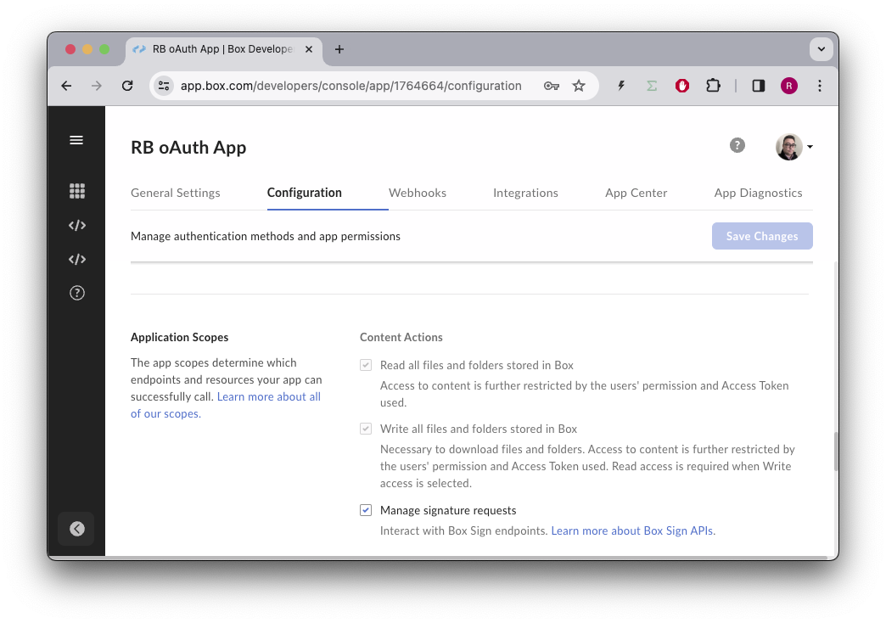

# Sign Templates


## Pre-requisites
Make sure your Box app is configured to use the following scopes:



> ### Note
> If the application scope is not available, then your account cannot use the Sign API and you won't be able to complete this exercise.

## Sign API
References to our documentation:
* [SDK Sign](https://github.com/box/box-python-sdk-gen/blob/main/docs/sign_requests.md)
* [API Guide](https://developer.box.com/guides/box-sign/)
* [API Reference ](https://developer.box.com/reference/resources/sign-request/)
* [Sign Guide](https://support.box.com/hc/en-us/articles/4404105810195-Sending-a-document-for-signature)

# Exercises
## Setup
Create a `sign_init.py` file on the root of the project and execute the following code:
```python
"""create sample content to box"""
import logging
from utils.box_client_oauth import ConfigOAuth, get_client_oauth

from workshops.sign_templates.create_samples import create_samples

logging.basicConfig(level=logging.INFO)
logging.getLogger("box_sdk_gen").setLevel(logging.CRITICAL)

conf = ConfigOAuth()


def main():
    client = get_client_oauth(conf)
    create_samples(client)


if __name__ == "__main__":
    main()
```
Result:
```
INFO:root:Folder workshops with id: 234108232105
INFO:root:Folder sign with id: 234103953351
INFO:root:Folder signed docs with id: 234102987614
INFO:root:Folder docs with id: 234103761574
INFO:root:      Uploaded Simple-PDF.pdf (1355143830404) 17639 bytes
INFO:root:      Uploaded Scholarship-Contract-Prep.docx (1358047520478) 16365 bytes
INFO:root:      Uploaded Simple-DOC.docx (1358077513913) 12409 bytes
```

Next, create a `sign_templates.py` file on the root of the project that you will use to write your code.
Take note of the above document ids and include statics for them in the doc.
Replace the `YOUR_EMAIL` with your email, or use a different email for each signer.

```python
"""Box Shared links"""
import logging

from utils.box_client_oauth import ConfigOAuth, get_client_oauth
from box_sdk_gen.client import BoxClient as Client
from box_sdk_gen.schemas import (
    SignRequest,
    SignRequestCreateSigner,
    SignRequestPrefillTag,
    FolderBaseTypeField,
    FolderMini,
)

logging.basicConfig(level=logging.INFO)
logging.getLogger("box_sdk_gen").setLevel(logging.CRITICAL)

SIGN_DOCS_FOLDER = "234102987614"

SIMPLE_PDF = "1355143830404"
SIMPLE_DOC = "1358077513913"
CONTRACT = "1358047520478"

SIGNER_A = "YOUR_EMAIL+A@gmail.com"
SIGNER_A_PHONE = "+15554443322"

SIGNER_B = "YOUR_EMAIL+B@gmail.com"

APPROVER = "YOUR_EMAIL+APPROVER@gmail.com"
FINAL_COPY = "YOUR_EMAIL+FINAL_COPY@gmail.com"

def check_sign_request(sign_request: SignRequest):
    print(f"\nSimple sign request: {sign_request.id}")
    print(f"  Status: {sign_request.status.value}")
    print(f"  Signers: {len(sign_request.signers)}")
    for signer in sign_request.signers:
        print(f"    {signer.role.value}: {signer.email}")
    print(f"  Prepare url: {sign_request.prepare_url}")


def main():
    """Simple script to demonstrate how to use the Box SDK"""
    conf = ConfigOAuth()
    client = get_client_oauth(conf)

    user = client.users.get_user_me()
    print(f"\nHello, I'm {user.name} ({user.login}) [{user.id}]")


if __name__ == "__main__":
    main()
```
Resulting in:
```
Hello, I'm Rui Barbosa  [18622116055]
```

## Concepts

A Sign template is a special type of document that not only contains the text, but also the signature requirements and placement.
Essentially a Sign template is a document that is prepared for signing, and as such can be sent directly to the signer.

Signature requirements include the signature pad field, the full name, the date, and many more options.

These requirements can be `mandatory` or `optional` and can also be pre-populated by your application. However even if pre-populated, they can always be changed by the `signer`.


## Create a template
Let's start by creating a simple Sign template.

From the Box app navigate to the Sign menu on the left, then select templates.


Then click on the `New Template` button, and click choose or upload document from Box.
Navigate to `workshops/sign/docs` and select `Simple-PDF.pdf` and click `Next`.


Drag and drop a date, a name and a signature pad field to the template, like so:


Save the template.

## Identify the template
Now that we have a template, let's identify it in our code. Create this method:
```python
def sign_templates_list(client: Client):
    """List all sign templates"""
    sign_templates = client.sign_templates.get_sign_templates()
    print(f"\nSign templates: {len(sign_templates.entries)}")
    for sign_template in sign_templates.entries:
        print(f"  {sign_template.id} - {sign_template.name}")
```
And use it on our main method:
```python
def main():
    """Simple script to demonstrate how to use the Box SDK"""
    conf = ConfigOAuth()
    client = get_client_oauth(conf)

    user = client.users.get_user_me()
    print(f"\nHello, I'm {user.name} ({user.login}) [{user.id}]")

    sign_templates_list(client)


if __name__ == "__main__":
    main()
```
Resulting in:
```
Hello, I'm Rui Barbosa [18622116055]

Sign templates: 1
  94e3815b-f7f5-4c2c-8a26-e9ba5c486031 - Simple-PDF.pdf
```
Take note of the template id, and create a global variable for it:
```python
logging.basicConfig(level=logging.INFO)
logging.getLogger("box_sdk_gen").setLevel(logging.CRITICAL)

SIGN_DOCS_FOLDER = "234102987614"
...

TEMPLATE_SIMPLE = "94e3815b-f7f5-4c2c-8a26-e9ba5c486031"
```

## Create a signature request
We can now create signature requests based on the template. Add this method to your code:
```python
def create_sign_request(client: Client, template_id: str, signer_email: str):
    """Create sign request from template"""
    parent_folder = FolderMini(
        id=SIGN_DOCS_FOLDER, type=FolderBaseTypeField.FOLDER
    )

    signer = SignRequestCreateSigner(
        email=signer_email,
    )

    sign_request = client.sign_requests.create_sign_request(
        signers=[signer],
        parent_folder=parent_folder,
        template_id=template_id,
    )

    return sign_request
```
And use it on our main method: 
```python
def main():
    ...

    # Create sign request from template
    sign_request = create_sign_request(client, TEMPLATE_SIMPLE, SIGNER_A)
    check_sign_request(sign_request)
```
Resulting in:
```
Simple sign request: b25674a2-540b-4201-ae18-a78f05ef1a9a
  Status: created
  Signers: 2
    final_copy_reader: ...@gmail.com
    signer: YOUR_EMAIL+a@gmail.com
  Prepare url: None
```
Go to the inbox of the sender and complete the signature request.

>Notice that there was no document preparation required, since the template already had the signature requirements.

>Also the date is automatically populated with the current date.

But what if we want to pre-populate the name?

## Pre-populate the signature attributes
Go back to the template design and add an id to the name field, like so:


Save the template.

Let's create a new method to pre-populate the name:
```python
def create_sign_request_name_default(
    client: Client, template_id: str, signer_name, signer_email: str
):
    """Create sign request from template"""
    parent_folder = FolderMini(
        id=SIGN_DOCS_FOLDER, type=FolderBaseTypeField.FOLDER
    )

    signer = SignRequestCreateSigner(
        email=signer_email,
    )

    # tags
    tag_full_name = SignRequestPrefillTag(
        document_tag_id="signer_full_name",
        text_value=signer_name,
    )

    sign_request = client.sign_requests.create_sign_request(
        signers=[signer],
        parent_folder=parent_folder,
        prefill_tags=[tag_full_name],
        template_id=template_id,
    )

    return sign_request
```
And use it on our main:
```python
def main():
    ...

    # Create sign request from template with name
    sign_request_name = create_sign_request_name_default(
        client, TEMPLATE_SIMPLE, "Signer A", SIGNER_A
    )
    check_sign_request(sign_request_name)
```
Resulting in:
```
Simple sign request: adab1740-eeba-4392-a3f5-defddc79c946
  Status: created
  Signers: 2
    final_copy_reader: ...@gmail.com
    signer: ...+a@gmail.com
  Prepare url: None
```
Open the signer inbox and complete the signature request.


>Notice that the name is now pre-populated. However the `signer` can still change it.

Pre-populating the signature attributes is a great way to save the signer time. Using the ` document_tag_id` allows your app to integrate any other data source, contextualizing the document with extra information.

# Get more information about a template
We've seen that we can list the templates available to a user.
But we can also get more information about a specific template.
Let's create a method that returns basic information of a template, and details all the signature requirements:
```python
def sign_template_print_info(client: Client, template_id: str):
    sign_template = client.sign_templates.get_sign_template_by_id(template_id)
    print(f"\nSign template: {sign_template.id} - {sign_template.name}")
    print(f"  Signers: {len(sign_template.signers)}")
    for signer in sign_template.signers:
        print(f"    {signer.role.value}")
        if len(signer.inputs) > 0:
            print("      Tag ID\t Type\t Required")
        for input in signer.inputs:
            print(
                f"      {input.document_tag_id} {input.type.value} {input.is_required}"
            )
```
And use it on our main method:
```python
def main():
    ...

    # Print sign template details
    sign_template_print_info(client, TEMPLATE_SIMPLE)
```
Resulting in:
```
Sign template: 94e3815b-f7f5-4c2c-8a26-e9ba5c486031 - Simple-PDF.pdf
  Signers: 2
    final_copy_reader
    signer
      Tag ID     Type    Required
      None date True
      signer_full_name text True
      None signature True
```
Notice that the `signer_full_name` is the tag id we used to pre-populate the name.

## Extra Credit
There are many other signature attributes that can be pre-populated, like the `company_name`, `dropdown`, and `checkboxes`.

Create a new template or modify an existing one to include more attributes, and pre-populate them in the signature request.


# Final thoughts
Templates are a form of structured documents where the signature requirements are already defined and placed on the document.

This not only keeps your legal department happy, but also avoids having the users do an extra step and prepare the document.

Finally if your document signature requirements have a lot of options, you can pre-populate these from another data source and save the user time.
Just remember that the user who owns these properties can always change them.

There is no API entry point to create a template, so you will have to create and manage them manually from the Box app.


