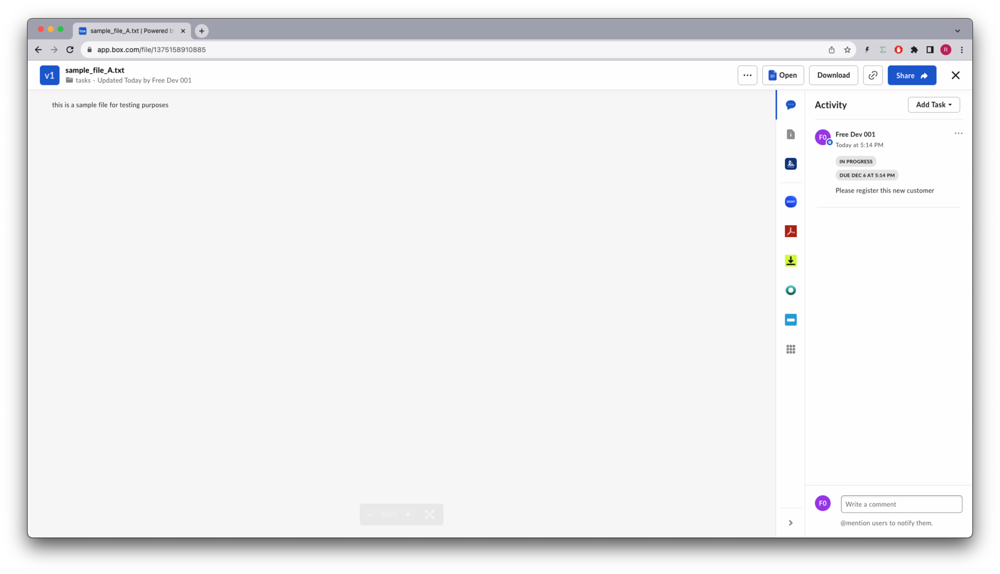
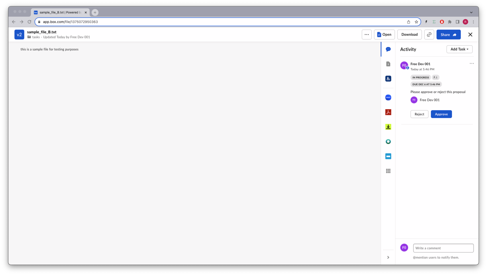

# Tasks
Tasks allow users to request collaborators on a file to review a file or complete a piece of work. Tasks can be used by developers to create file-centric workflows.

## Concepts
A task is primarily associated with a file.

There are two types of tasks, `review` and `complete`. 

A `review` task is used to request a collaborator to review a file, where the status can be `incomplete`, `approved` or `rejected`.

A `complete` task is used to request a collaborator to complete a piece of work. It can have the status of `incomplete` or `complete`.

A task can be assigned to single or multiple users, and has a `completion_rule` that determines if the task can be completed by any user (`any_assignee`), or requires all users (`all_assignees`).

A task can also have a due_at, specifying the date and time when the task needs to be completed.

Finally your app can include a message describing the tasks it self.

## Tasks API
References to our documentation:
* [SDK tasks](https://github.com/box/box-python-sdk-gen/blob/main/docs/tasks.md)
* [SDK task assignments](https://github.com/box/box-python-sdk-gen/blob/main/docs/task_assignments.md)
* [API Guide](https://developer.box.com/guides/tasks/)
* [API Reference](https://developer.box.com/reference/get-files-id-tasks/)
* [Support note](https://support.box.com/hc/en-us/articles/360043695954-Adding-Comments-and-Tasks)


# Exercises
## Setup
Create a `tasks_init.py` file on the root of the project and execute the following code:
```python
"""create sample content to box"""
import logging
from utils.box_client_oauth import ConfigOAuth, get_client_oauth

from workshops.tasks.create_samples import create_samples

logging.basicConfig(level=logging.INFO)
logging.getLogger("box_sdk_gen").setLevel(logging.CRITICAL)

conf = ConfigOAuth()


def main():
    client = get_client_oauth(conf)
    create_samples(client)


if __name__ == "__main__":
    main()
```
Result:
```
INFO:root:Folder workshops with id: 223095001439
INFO:root:Folder tasks with id: 237416051727
INFO:root:      Uploaded sample_file_B.txt (1375072950363) 42 bytes
INFO:root:      Uploaded sample_file_A.txt (1375158910885) 42 bytes
```

Next, create a `tasks.py` file on the root of the project that you will use to write your code.

Create a global constant named `TASKS_ROOT` and make it equal to the id of the `tasks` folder, in my case `237416051727`

Create a global constant named `SAMPLE_FILE_A` and make it equal to the id of the `sample_file_A.txt` file, in my case `1375158910885`

Create a global constant named `SAMPLE_FILE_B` and make it equal to the id of the `sample_file_B.txt` file, in my case `1375072950363`

```python
"""Box Tasks API example"""
import logging
from box_sdk_gen.fetch import APIException
from box_sdk_gen.client import BoxClient as Client
from box_sdk_gen.schemas import Task

from box_sdk_gen.managers.tasks import (
    CreateTaskItemArg,
    CreateTaskItemArgTypeField,
    CreateTaskActionArg,
    CreateTaskCompletionRuleArg,
)

from utils.box_client_oauth import ConfigOAuth, get_client_oauth

logging.basicConfig(level=logging.INFO)
logging.getLogger("box_sdk_gen").setLevel(logging.CRITICAL)


TASKS_ROOT = "237416051727"
SAMPLE_FILE_A = "1375158910885"
SAMPLE_FILE_B = "1375072950363"


def main():
    """Simple script to demonstrate how to use the Box SDK"""
    conf = ConfigOAuth()
    client = get_client_oauth(conf)

    user = client.users.get_user_me()
    print(f"\nHello, I'm {user.name} ({user.login}) [{user.id}]")


if __name__ == "__main__":
    main()
```

## Create a tasks for a file
Let us start by creating a task for a file.


```python
def create_task(
    client: Client,
    file_id: str,
    action: CreateTaskActionArg,
    message: str,
    due_date: datetime,
    rule: CreateTaskCompletionRuleArg,
) -> Task:
    """Create a task"""
    file = CreateTaskItemArg(
        file_id=file_id, type=CreateTaskItemArgTypeField.FILE
    )
    task = client.tasks.create_task(
        item=file,
        action=action,
        message=message,
        due_at=due_date,
        completion_rule=rule,
    )
    return task
```
Using it to create a task for `sample_file_A.txt`:
```python
def main():
    ...

    task_a = create_task(
        client,
        SAMPLE_FILE_A,
        CreateTaskActionArg.COMPLETE,
        "Please register this new customer",
        datetime.now(UTC) + timedelta(days=7),
        CreateTaskCompletionRuleArg.ALL_ASSIGNEES,
    )
    print(f"\nCreated task {task_a.id} for file {task_a.item.id}")


if __name__ == "__main__":
    main()
```
Result:
```
Hello, I'm Free Dev 001 (barduinor+001@gmail.com) [25428698627]

Created task 23863153599 for file 1375158910885
```
Now if we navigate to our file and check the activity, we'll se the task created:


Note that the task is not assigned to anyone just yet, but it is in progress, has a due date and the message we set.

## Assigning a task to a user
Let's create a method to assign a task to a user.
```python
def assign_task_to_user(
    client: Client, task_id: str, user_id: str
) -> TaskAssignment:
    """assign task"""

    task = task = CreateTaskAssignmentTaskArg(
        id=task_id, type=CreateTaskAssignmentTaskArgTypeField.TASK
    )

    assign_to = CreateTaskAssignmentAssignToArg(
        id=user_id,
    )
    assignment = client.task_assignments.create_task_assignment(
        task=task, assign_to=assign_to
    )

    return assignment
```
And create a new task, this time for `SAMPLE_FILE_B`, and assign it to the user:
```python
def main():
    ...

    # create and assign a review task and assign it
    task_b = create_task(
        client,
        SAMPLE_FILE_B,
        CreateTaskActionArg.REVIEW,
        "Please approve or reject this proposal",
        datetime.now(UTC) + timedelta(days=7),
        CreateTaskCompletionRuleArg.ANY_ASSIGNEE,
    )
    print(f"\nCreated task {task_b.id} for file {task_b.item.id}")

    assignment = assign_task_to_user(client, task_b.id, user.id)
    print(
        f"\nCreated assignment {assignment.id} for user {assignment.assigned_to.name}"
    )
```
Resulting in:
```
Created task 23863571592 for file 1375072950363

Created assignment 54406160867 for user Free Dev 001
```
Now if we navigate to sample_file_b.txt in our Box app:


Notice the task is assigned to a user, and because it is a review task, you can approve or reject it.


## Extra Credit

# Final thoughts


