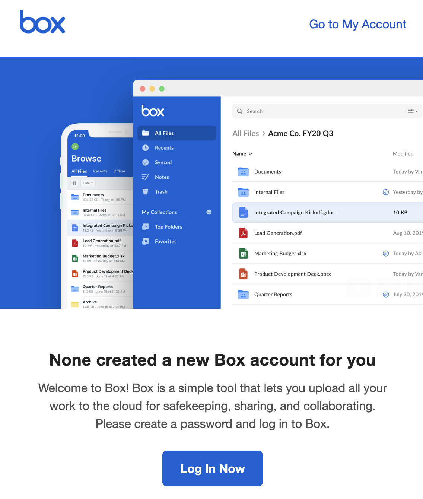
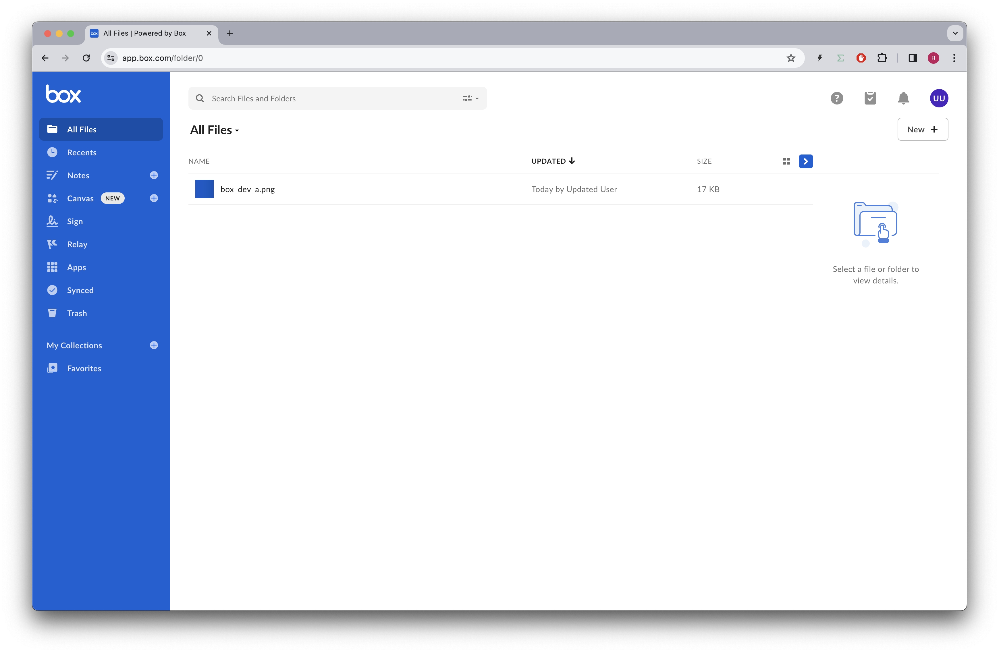
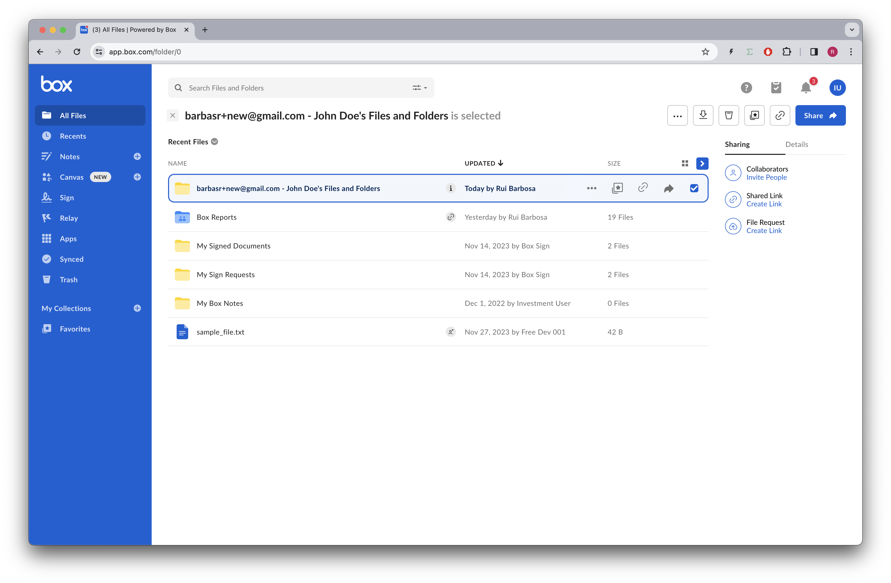

# Users

The Box API supports a variety of users, ranging from real employees logging in with their Managed User account, to applications using App Users to drive powerful automation workflows.

## Pre-requisites
The free Box accounts do not support multiple users, so you will need to have a Box paid account, or a full developer account to be able to use this feature.

## Concepts

Within the Box Platform API we can manage multiple types of users:
* Managed Users - Users with a login that belong to and are managed by an enterprise.
* External users - Users without a login that belong to another enterprise (or no enterprise at all), but are referenced withing the enterprise, i.e. they are collaborators.
* Service account users - These are automatically created when you create an application using JWT or CCG authentication. They are used to represent the application itself.
* Application users - Users without a login that exist in the context of an application. For example, imagine you have a document management application that uses Box as a backend. You can create an application user for each user of your application, and then use the Box API to manage the content of each application user.

Users are also the main way to manage content sharing in Box. When you share a folder with a user, you are actually creating a collaboration between the folder and the user. The collaboration is the entity that defines the permissions that the user has over the folder.


## Users documentation
References to our documentation:
* [Guide](https://developer.box.com/guides/users/)
* [User types](https://developer.box.com/platform/user-types/)
* [Users API](https://developer.box.com/reference/resources/user/)
* [Transfer API](https://developer.box.com/reference/put-users-id-folders-0/)

# Exercises
## Setup
Create a `users_init.py` file on the root of the project and execute the following code:
```python
"""create sample content to box"""
import logging
from utils.box_client_oauth import ConfigOAuth, get_client_oauth

from workshops.users.create_samples import create_samples

logging.basicConfig(level=logging.INFO)
logging.getLogger("box_sdk_gen").setLevel(logging.CRITICAL)

conf = ConfigOAuth()


def main():
    client = get_client_oauth(conf)
    create_samples(client)


if __name__ == "__main__":
    main()

```
Result:
```
INFO:root:Folder workshops with id: 234108232105
INFO:root:Folder users with id: 241838082529
```

Next, create a `users.py` file on the root of the project that you will use to write your code.


```python
import logging

from box_sdk_gen.client import BoxClient as Client

from utils.box_client_oauth import ConfigOAuth, get_client_oauth


logging.basicConfig(level=logging.INFO)
logging.getLogger("box_sdk_gen").setLevel(logging.CRITICAL)


def main():
    """Simple script to demonstrate how to use the Box SDK"""
    conf = ConfigOAuth()
    client = get_client_oauth(conf)


if __name__ == "__main__":
    main()
```


## Who am I?

We can easily check who is the current logged in user with the following code:

```python
def main():
    ...

    me = client.users.get_user_me()
    print(f"\nHello, I'm {me.name} ({me.login}) [{me.id}]")

```

Resulting in:
```
Hello, I'm Rui Barbosa (barduinor@gmail.com) [18622116055]
```

## Listing enterprise users

We can list all the users in the enterprise with the following code:

```python
def list_users(client: Client):
    """List users"""
    users = client.users.get_users()
    for user in users.entries:
        print(f"{user.name} ({user.login}) [{user.id}]")
```
Resulting in:
```
Test APP User (AppUser_1841316_JrbcGiq4sH@boxdevedition.com) [29598579694]
Test APP User (AppUser_1841316_rsjIlqVZCZ@boxdevedition.com) [29599213288]
Test APP User (AppUser_1841316_WPijcZsfjv@boxdevedition.com) [29598695136]
Investment User (barduinor+inv@gmail.com) [22240548078]
Wealth User (barduinor+we@gmail.com) [22240405099]
Wholesale User (barduinor+wh@gmail.com) [22240545678]
Rui Barbosa (barduinor@gmail.com) [18622116055]
```

In my example the first 3 users are application users, and the last 4 are managed users.

## Creating a managed user
User is one of the most extensive objects in the Box API. Let's create a managed user with the minimum information required, name and login (email):

```python
def create_user(client: Client, name: str, login: str) -> User:
    """Create a user"""
    try:
        user = client.users.create_user(name, login)
    except APIException as err:
        if err.status == 409 and err.code == "user_login_already_used":
            # User already exists, let's get it
            user = client.users.get_users(login).entries[0]
        else:
            raise err
    return user

def main():
    ...

    # create a user
    new_user = create_user(client, "Test User", "your_email@example.com")
    print(f"\nNew user: {new_user.name} ({new_user.login}) [{new_user.id}]")
```

> Note: The user creation accepts 18+ parameters, but we are only using 2 of them. The other parameters are optional and can be used to provide more information about the user, like the phone number, timezone, etc.

Resulting in:

```
New user: Test User (your_email@example.com) [30979098580]
```
If you check the new user email, you'll find an email from Box asking you to activate the account:



Go ahead and activate the account.

## Updating a user

Similar to the create this API also accepts a lot of parameters. Let's update the user we just created to add a phone number and address:

```python
def update_user(
    client: Client,
    user_id: str,
    name: str,
    login: str,
    phone: str,
    address: str,
) -> User:
    """Update a user"""
    user = client.users.update_user_by_id(
        user_id,
        name=name,
        login=login,
        phone=phone,
        address=address,
    )
    return user

def main():
    ...

    # update a user
    updt_user = update_user(
        client,
        new_user.id,
        "John Doe",
        "your_email@example.com",
        "+15551234567",
        "123 Main St",
    )
    print(f"\nUpdated user: {updt_user.name} {updt_user.id}")
    print(f"Login: {updt_user.login}")

    print(f"Phone: {updt_user.phone}")
    print(f"Address: {updt_user.address}")
```

Resulting in:
```yaml
Updated user: John Doe 30979098580
Login: your_email@example.com
Phone: +15551234567
Address: 123 Main St
```

## Transferring content ownership

Login with the user you just created and upload a file to it.



Often administrators have to transfer content ownership from one user to another, as user leave the company or change roles. 

Let's transfer the content from John Doe to one of my users, `Investment User [22240548078]`, but you can use yourself.

This can be done with the following code:

```python
def user_transfer(
    client: Client, source_user_id: str, destination_user_id: str
):
    owned_by = TransferOwnedFolderOwnedByArg(destination_user_id)
    client.transfer.transfer_owned_folder(source_user_id, owned_by)

def main():
    ...

    # transfer content
    user_transfer(client, new_user.id, "22240548078")

```

Now when we login with the user who receive the transfer we can see a folder was created to hold all content from John Doe:



## Deleting a user

Now that we transferred all the content from John Doe, we can delete the user:

```python
def delete_user(client: Client, user_id: str):
    client.users.delete_user_by_id(user_id)

def main():
    ...

    # delete user
    delete_user(client, new_user.id)
    list_users(client)
```


## Extra credit
* The list users API has a lot of options to filter the results. Try to use some of them to filter the results.
* This application is using OAuth2 authentication. Try to change it to use CCG authentication.
* Using the CCG authentication create an application user under the CCG service account.
* Upload a file to the application user and then share it with your managed user.


# Final thoughts
From an API perspective, the users end point is a simple CRUD. 

However, it is the foundation of the Box Platform, as it is the way to manage content sharing and permissions. It is also the way to manage the users of your application, if you are building one.

Multiple user types are also a powerful way to manage content ownership and permissions. For example, you can create a service account user to represent your application, and then use it to manage content in the context of your application.


